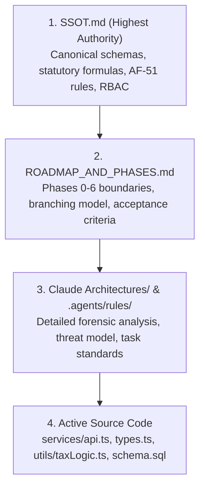

# AGENTS.md — AI Agent Operating System & Engineering Protocol
**LGU Treasury Connect — Real Property Tax Administration System (RPTAS)**  
**Municipality of Santa Rosa, Province of Nueva Ecija, Philippines**

---

## 1. System Identity & Mission

**LGU Treasury Connect** is a mission-critical Real Property Tax Administration System (RPTAS) engineered for the Municipal Treasurer's Office of Santa Rosa, Nueva Ecija. It administers property assessments (RPTAR masterlist), calculates statutory tax liabilities and delinquency surcharges under **Republic Act No. 7160 (Local Government Code of 1991)**, issues official receipts (Accountable Form 51), and provides real-time executive revenue dashboards.

All AI agents working in this repository must operate under this protocol to ensure zero financial data corruption, statutory legal compliance, and architectural consistency.

---

## 2. Canonical Hierarchy of Truth

When making architectural, mathematical, or implementation decisions, agents must adhere to the following strict hierarchy of truth:



1. **[`docs/SSOT.md`](file:///home/jeipyyy/Documents/Projects/LGU-Treasury-Connect/lgu-treasury-connect/docs/SSOT.md)** *(Highest Authority)*: The definitive Single Source of Truth for database schemas, statutory tax math, COA financial controls, role permissions, and interface contracts.
2. **[`docs/ROADMAP_AND_PHASES.md`](file:///home/jeipyyy/Documents/Projects/LGU-Treasury-Connect/lgu-treasury-connect/docs/ROADMAP_AND_PHASES.md)**: Defines the phased delivery plan, branch boundaries, acceptance criteria, and git workflow.
3. **[`docs/Claude Architectures/`](file:///home/jeipyyy/Documents/Projects/LGU-Treasury-Connect/lgu-treasury-connect/docs/Claude%20Architectures)** & **[`.agents/rules/task_standards.md`](file:///home/jeipyyy/Documents/Projects/LGU-Treasury-Connect/lgu-treasury-connect/.agents/rules/task_standards.md)**: Deep forensic architectural documentation, security risk registries, and operational task constraints.
4. **Active Source Code**: Ground reality of the working tree. When code diverges from the SSOT, the SSOT governs and the code must be refactored toward the SSOT.

---

## 3. Mandatory Agent Operational Rules

### 3.1 Stop-and-Wait Protocol (Human-in-the-Loop)
- **Hard Rule**: After modifying, refactoring, or creating any single component, modal, or script, the agent **MUST STOP IMMEDIATELY**, provide a concise summary of changes, and wait for human confirmation before touching the next file.
- Batching multiple component refactors across a single turn without explicit permission is strictly forbidden.

### 3.2 No Self-Certification
- Agents **MUST NOT** declare their own work:
  - `APPROVED`
  - `GO`
  - `SECURITY-SAFE`
  - `PRODUCTION-READY`
- Final architectural, financial, and security sign-off belongs exclusively to the human lead / reviewer.

### 3.3 Change Budget Enforcement
Every implementation plan and task execution must declare and respect its change budget:
- Maximum files allowed to change.
- Schema/API/UI/Business logic modification flags.
- Any change exceeding the declared budget requires **IMMEDIATE STOP + RE-APPROVAL**.

---

## 4. Invariant Domain & Business Rules (NEVER BREAK)

The following statutory rules are non-negotiable and legally binding under Philippine Law (RA 7160 Title II):

### 4.1 Statutory Tax Engine
- **Base Tax Rate**: Exactly `2.00%` (`0.02`) of Assessed Value:
  - `1.00%` Basic Real Property Tax (General Fund).
  - `1.00%` Special Education Fund (Local School Board).
- **Delinquency Penalty (Surcharge)**: Exactly `2.00%` per month of delinquency (`0.02`), strictly capped at `36 months` (`72%` maximum statutory penalty under RA 7160 Sec. 255).
- **Discounts**:
  - `10%` prompt discount on current year if paid on or before quarterly deadline.
  - `20%` advance discount if paid prior to January 1 of the tax year.
  - Discounts apply **only** to the current/advance year, never to delinquent years.
- **Unit Test Protection**: All changes to `utils/taxLogic.ts` must pass [`utils/taxLogic.test.ts`](file:///home/jeipyyy/Documents/Projects/LGU-Treasury-Connect/lgu-treasury-connect/utils/taxLogic.test.ts).

### 4.2 "Arrears-First" Sequential Verification Rule
- Taxpayers **cannot** have current year (2026) dues cleared or verified while prior-year delinquent liabilities exist.
- Dues must be reviewed and verified strictly in chronological order starting from the oldest unpaid year ($\text{lastPaidYear} + 1$).

### 4.3 Shell Record Verification Prohibition
- Properties with `is_shell_record = true` (legacy/unverified parcels lacking PIN or complete valuation) **cannot** have delinquency verified or Tax Clearance Certificates issued until verified by the Municipal Assessor.

### 4.4 Delinquency Verification & External Settlement Evidence Protocol
- **Canonical Lifecycle**: Verification uses explicit states (`UNVERIFIED`, `VERIFIED_OUTSTANDING`, `VERIFIED_SETTLED_EXTERNALLY`, `DISPUTED`, `NOT_APPLICABLE`, `SUPERSEDED`).
- **External Evidence Standards**: Store external official receipt (AF-51) number, check reference, or registry folio citation without performing system cash collection.
- **Supervisory Reversal**: Reversing or superseding a verified record requires `Admin` authorization and logs a mandatory justification to `rptar_audit_logs`.

---

## 5. Technology Stack & Directory Conventions

### 5.1 Technology Standards
- **Core**: React 18, TypeScript (`strict: true`), Vite.
- **Styling**: Tailwind CSS v3 compiled locally via PostCSS (`postcss.config.js`). **Zero external CDN scripts allowed.**
- **Design System**: shadcn/ui primitives (`components/ui/`) styled with Santa Rosa Treasury tokens:
  - Emerald Green accents (`#059669` / `#065f46`).
  - Slate neutrals (`#0f172a` to `#f8fafc`).
  - Dark mode ready; fully accessible via Radix UI primitives.
- **Charts**: Recharts (`ResponsiveContainer`, `BarChart`, `AreaChart`).
- **Testing**: Vitest (`npm run test:unit`).
- **Linting**: ESLint v9 flat configuration (`eslint.config.js`).

### 5.2 Directory Boundaries & Dead Code Notice
```
lgu-treasury-connect/
├── components/          # UI Components & Modals (using components/ui/ primitives)
│   ├── ui/              # shadcn/ui headless accessible primitives
│   └── common/          # Reusable shared domain presentation components
├── features/            # Feature-sliced domain modules (auth, assessment, properties, reports)
├── services/            # API abstraction and transport drivers
│   ├── api.ts           # Unified API interface
│   └── supabase.ts      # Supabase PostgREST client
├── utils/               # Pure calculation engines and test suites
│   ├── taxLogic.ts      # Pure RA 7160 tax calculation engine
│   └── taxLogic.test.ts # Vitest unit test suite
├── docs/                # Project Documentation & Single Source of Truth
│   ├── SSOT.md          # Canonical Single Source of Truth
│   ├── IMPLEMENTATION_PLAN_VERIFICATION_STATEMENT_SYSTEM.md # Authoritative Scope & Execution Plan
│   └── Claude Architectures/# Historical deep-dive documentation (REFERENCE ONLY)
├── server/              # DEAD CODE: Legacy Express/SQLite server (DO NOT USE)
└── AGENTS.md            # This agent operating guideline
```

> [!WARNING]
> **Dead Code Warning**:
> 1. `server/` directory contains an inactive Express + SQLite server. Do not touch or import from it.
> 2. `features/collections/` and `services/offline/` have been permanently purged per the Delinquency Verification & Statement System scope lock.

---

## 6. Implementation Plan & Branching Protocol

Agents must work within the boundaries defined in [`docs/IMPLEMENTATION_PLAN_VERIFICATION_STATEMENT_SYSTEM.md`](file:///home/jeipyyy/Documents/Projects/Municipal-Treasurers-Office-Delinquency-System/Municipal-Treasurers-Office-Delinquency-System/docs/IMPLEMENTATION_PLAN_VERIFICATION_STATEMENT_SYSTEM.md) on branch `feat/delinquency-verification-statement-system`:

1. **Stage 0–2**: Scope lock, domain vocabulary (`UNVERIFIED`, `VERIFIED_SETTLED_EXTERNALLY`), and 2-role RBAC (`Admin`, `Assessor`).
2. **Stage 3–4**: Decouple and purge active cashiering/tellering surfaces and maintain durable import review.
3. **Stage 5–7**: Delinquency verification and completion models (`delinquency_period_verifications`), historical AV provenance, and RA 7160 statutory engine.
4. **Stage 8–10**: Statement of Account (SOA & CSV export), RA 7160 Sec. 254 Notice of Delinquency, and conditional Tax Clearance Certificate.
5. **Stage 11–14**: Audit trail integrity, UI simplification, and real-world pilot roll verification.

---

## 7. Verification Checklist & Definition of Done

Before requesting human confirmation on any task, an agent must execute and confirm the following:

```bash
# 1. Type verification
npx tsc --noEmit

# 2. Linting (0 errors, 0 warnings required)
npm run lint

# 3. Unit tests (All tax formulas must pass)
npm run test:unit

# 4. Production build verification
npm run build
```

### Response Format Requirements
When presenting results to the human lead:
1. **Action Taken**: Explicit list of files created, modified, or deleted with clickable links.
2. **Verification Evidence**: Output summary of `tsc`, `lint`, `test:unit`, and `build`.
3. **SSOT / Roadmap Alignment**: Note which section of [`docs/SSOT.md`](file:///home/jeipyyy/Documents/Projects/LGU-Treasury-Connect/lgu-treasury-connect/docs/SSOT.md) or [`docs/ROADMAP_AND_PHASES.md`](file:///home/jeipyyy/Documents/Projects/LGU-Treasury-Connect/lgu-treasury-connect/docs/ROADMAP_AND_PHASES.md) was satisfied.
4. **Clear Stop**: Stop immediately and prompt for human approval before taking any further action.
