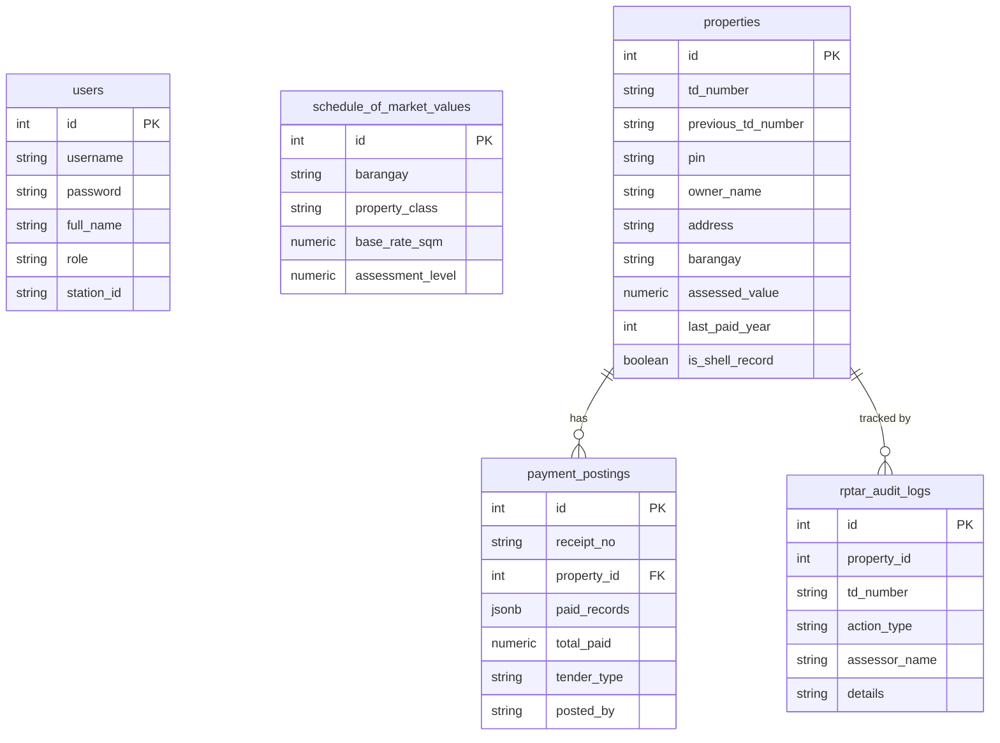
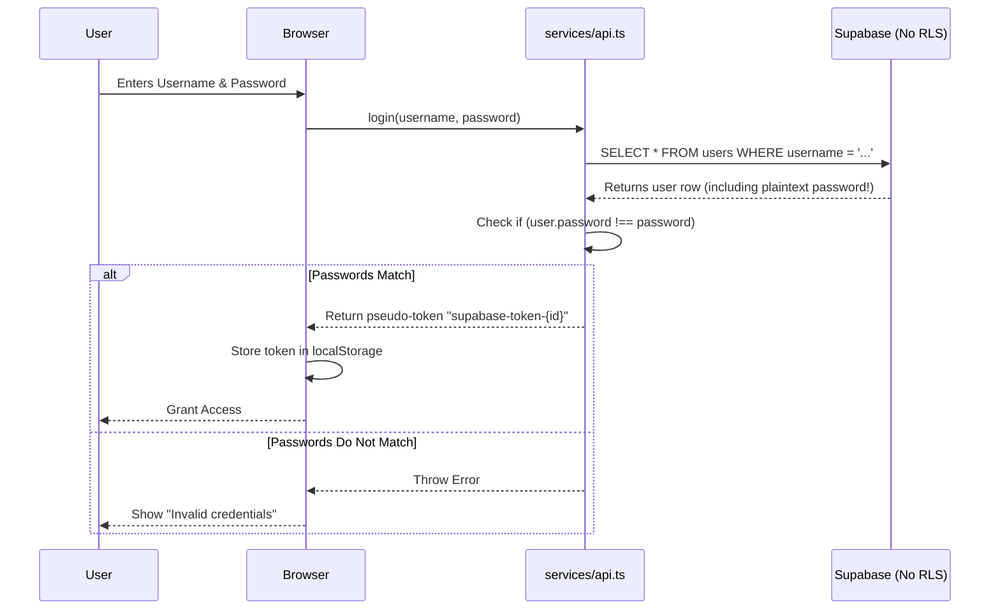
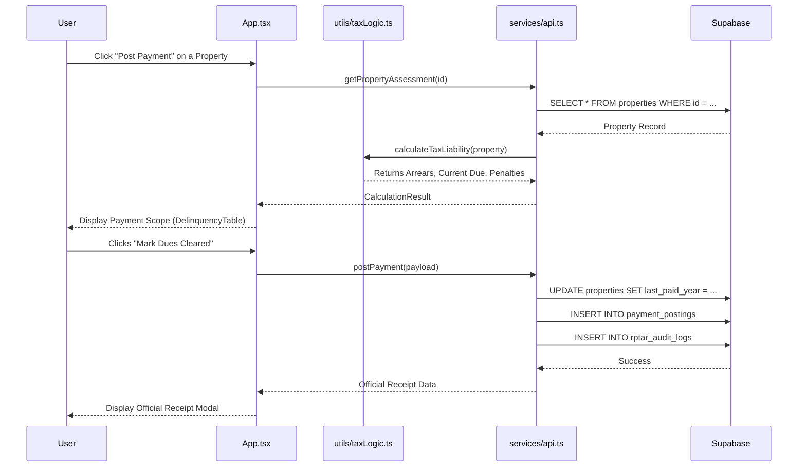

# ARCHITECTURE DIAGRAMS

## 1. Overall System Architecture
This diagram outlines the real, active architecture of the application (Client-Server with BaaS). It explicitly shows the inactive Express server to avoid confusion.

```mermaid
graph TD
    User([End User / Assessor]) --> ReactApp[React SPA Frontend]
    
    subgraph Frontend [LGU Treasury Connect - Frontend]
        ReactApp --> State[App.tsx State Manager]
        State --> UI[Components / Modals]
        UI --> BusinessLogic[Tax Engine: utils/taxLogic.ts]
        BusinessLogic --> APIClient[API Layer: services/api.ts]
    end

    APIClient -- HTTP / REST --> Supabase[Supabase Cloud]

    subgraph Backend [Backend-as-a-Service]
        Supabase --> Postgres[(PostgreSQL Database)]
    end
    
    subgraph Inactive [Dead / Unused System]
        Express[Express REST API] -.-x SQLite[(treasury.db)]
    end
    
    classDef dead fill:#f9f,stroke:#333,stroke-width:2px,stroke-dasharray: 5 5;
    class Express,SQLite Inactive dead;
```

## 2. Database Relationships
This entity-relationship diagram maps the Supabase PostgreSQL schema.



## 3. Flawed Authentication Flow
This diagram illustrates the current, insecure authentication implementation.



## 4. Main Request Lifecycle & Tax Workflow
This outlines what happens when a user views a property and makes a payment.



## 5. Deployment Architecture
This details how the frontend is built and served.

```mermaid
graph LR
    Developer -->|Git Push| GitHub[GitHub Repository]
    
    subgraph CI/CD [GitHub Pages Workflow]
        GitHub -->|npm run build| Build[Vite Build (dist/)]
        Build --> Deploy[gh-pages branch]
    end
    
    Deploy -->|Static Hosting| Browser[User's Browser]
    Browser -->|API Requests| SupabaseCloud[(Supabase Cloud)]
```
