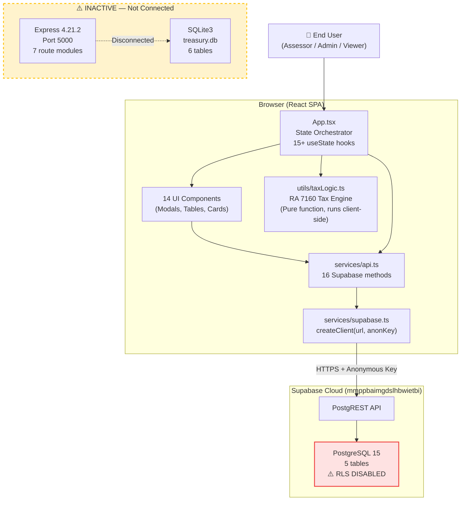
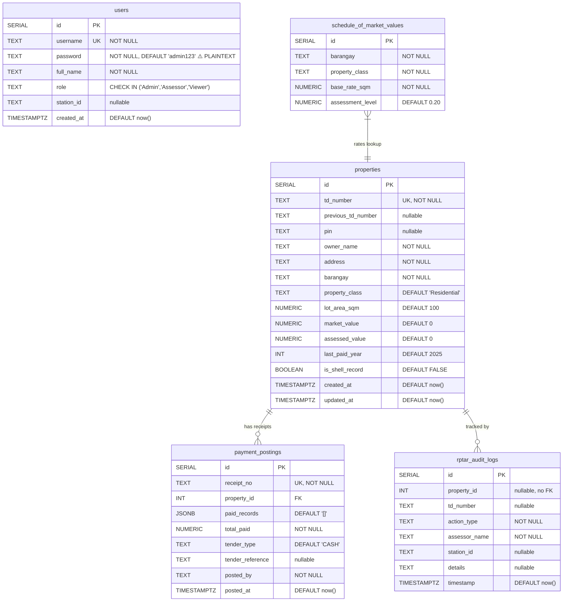
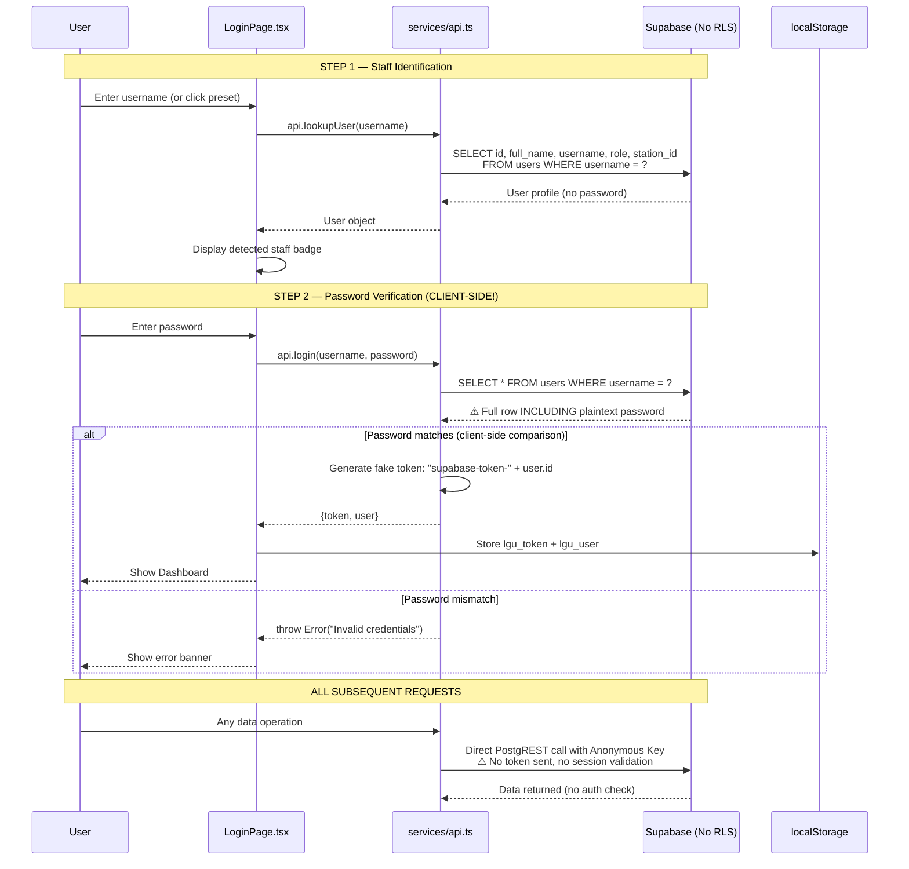
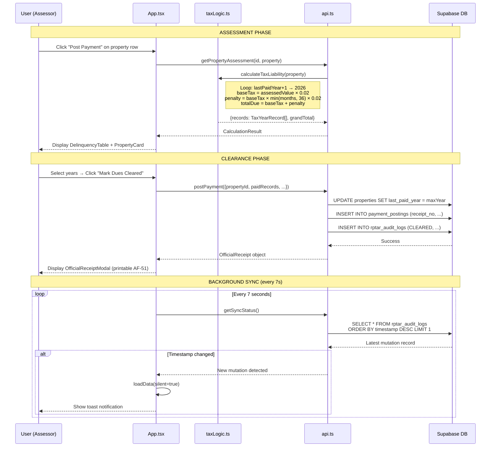
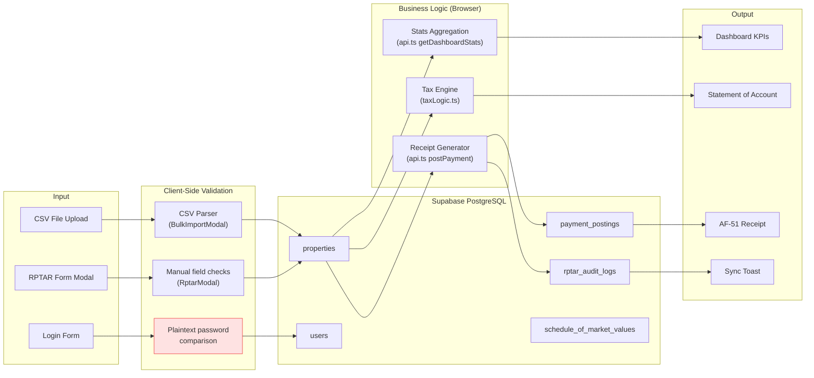
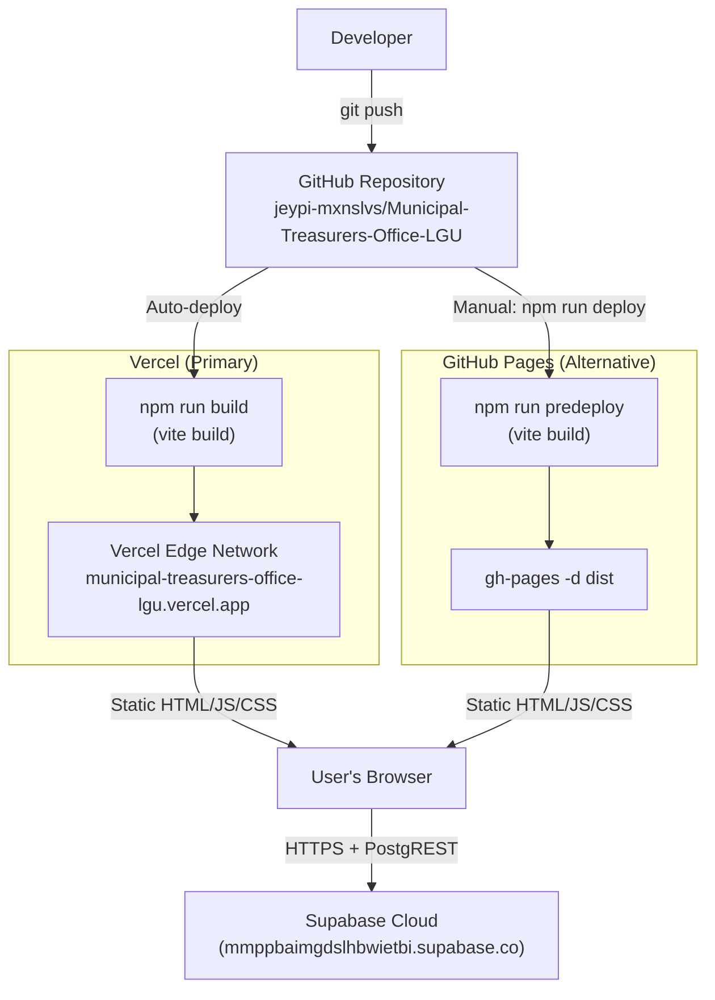

# ARCHITECTURE DIAGRAMS — LGU Treasury Connect

> Generated from code-level analysis, 2026-09-01

---

## 1. Overall System Architecture

---

## 2. Frontend Component Tree

```mermaid
graph TD
    Index["index.tsx<br/>ReactDOM.createRoot"]
    App["App.tsx<br/>(God Object)"]
    
    subgraph AuthGate ["Authentication Gate"]
        LoginPage["LoginPage.tsx<br/>2-step login + presets"]
    end
    
    subgraph DashView ["view === 'dashboard'"]
        Stats["DashboardStats.tsx<br/>4 KPI cards + Recharts chart"]
        Table["DashboardTable.tsx<br/>Paginated masterlist<br/>Search + Filter + RBAC"]
    end
    
    subgraph PostView ["view === 'posting'"]
        PropCard["PropertyCard.tsx<br/>Property summary"]
        DelinqTable["DelinquencyTable.tsx<br/>Statement of Account<br/>Sequential selection"]
    end
    
    subgraph Modals ["Overlay Modals"]
        RptarMod["RptarModal.tsx<br/>Add/Edit property"]
        ReceiptMod["OfficialReceiptModal.tsx<br/>AF-51 receipt"]
        UserMgmt["UserManagementModal.tsx<br/>Admin staff CRUD"]
        AuditMod["AuditLogModal.tsx<br/>Revision timeline"]
        BulkMod["BulkImportModal.tsx<br/>CSV parser + importer"]
    end
    
    Header["Header.tsx<br/>Navbar + User badge + Logout"]
    
    Index --> App
    App -->|"!currentUser"| LoginPage
    App -->|"currentUser"| Header
    App -->|"view=dashboard"| Stats
    App -->|"view=dashboard"| Table
    App -->|"view=posting"| PropCard
    App -->|"view=posting"| DelinqTable
    App --> RptarMod
    App --> ReceiptMod
    App --> UserMgmt
    App --> AuditMod
    App --> BulkMod

    style App fill:#dbeafe,stroke:#2563eb,stroke-width:3px
    style LoginPage fill:#fef3c7,stroke:#f59e0b,stroke-width:2px
```

---

## 3. Database Entity Relationships (Supabase PostgreSQL)

---

## 4. Authentication Flow (Current — INSECURE)

---

## 5. Tax Assessment & Payment Flow

---

## 6. Data Flow Architecture

---

## 7. Deployment Architecture

---

## 8. Dependency Graph

```mermaid
graph TD
    subgraph External ["External Dependencies"]
        React["react 19.2.4"]
        ReactDOM["react-dom 19.2.4"]
        SupabaseSDK["@supabase/supabase-js 2.112.3"]
        Recharts["recharts 3.7.0"]
        Lucide["lucide-react 0.563.0"]
        TailwindCDN["Tailwind CSS (CDN)"]
    end
    
    subgraph App ["Application Modules"]
        AppTsx["App.tsx"]
        TypesTs["types.ts"]
        ConstantsTs["constants.ts"]
        ApiTs["services/api.ts"]
        SupabaseTs["services/supabase.ts"]
        TaxLogicTs["utils/taxLogic.ts"]
    end
    
    subgraph Components ["UI Components"]
        C1["LoginPage"]
        C2["Header"]
        C3["DashboardStats"]
        C4["DashboardTable"]
        C5["DelinquencyTable"]
        C6["PropertyCard"]
        C7["RptarModal"]
        C8["OfficialReceiptModal"]
        C9["BulkImportModal"]
        C10["UserManagementModal"]
        C11["AuditLogModal"]
    end
    
    AppTsx --> TypesTs
    AppTsx --> ApiTs
    AppTsx --> C1 & C2 & C3 & C4 & C5 & C6 & C7 & C8 & C9 & C10 & C11
    
    ApiTs --> SupabaseTs
    ApiTs --> TaxLogicTs
    ApiTs --> TypesTs
    
    SupabaseTs --> SupabaseSDK
    
    TaxLogicTs --> TypesTs
    TaxLogicTs --> ConstantsTs
    
    C4 --> TaxLogicTs
    C4 --> ConstantsTs
    C9 --> ConstantsTs
    
    C1 & C2 & C3 & C4 & C5 & C6 & C7 & C8 & C10 & C11 --> TypesTs
    C1 & C9 & C10 --> ApiTs
    
    AppTsx --> React & ReactDOM
    C3 --> Recharts
    C1 & C2 & C3 & C4 & C5 & C7 & C8 & C9 & C10 & C11 --> Lucide

    style AppTsx fill:#dbeafe,stroke:#2563eb,stroke-width:3px
    style ApiTs fill:#d1fae5,stroke:#10b981,stroke-width:2px
    style TaxLogicTs fill:#fef3c7,stroke:#f59e0b,stroke-width:2px
```

