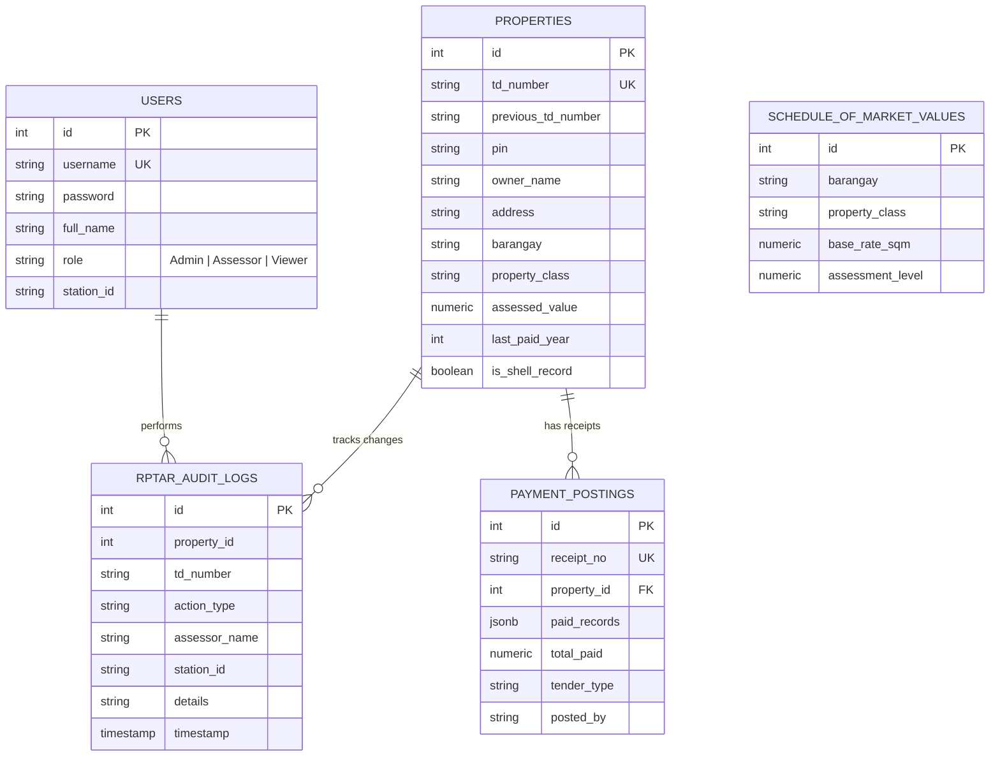

# 🏛️ Municipal Treasurer's Office — Real Property Tax Administration (RPTAR) System
### LGU Treasury Connect

[](https://municipal-treasurers-office-lgu.vercel.app/)
[](https://supabase.com)
[](https://react.dev)
[](https://www.typescriptlang.org/)

Modern Real Property Tax Administration and Collection System designed for the **Municipal Treasurer's Office (Local Government Unit – Santa Rosa, Nueva Ecija)**.

* **Status:** Active Production / Cloud-Deployed
* **Developer:** [Jan Paul R. Mensalvas](https://github.com/jeypi-mxnslvs) (BSIT Major in Database Systems Technology)
* **Live Demo:** [https://municipal-treasurers-office-lgu.vercel.app/](https://municipal-treasurers-office-lgu.vercel.app/)
* **GitHub Repository:** [https://github.com/jeypi-mxnslvs/Municipal-Treasurers-Office-LGU](https://github.com/jeypi-mxnslvs/Municipal-Treasurers-Office-LGU)

---

## Overview

**LGU Treasury Connect** streamlines the administration, appraisal, computation, and collection of Real Property Taxes (RPT) in full compliance with the **Philippine Local Government Code of 1991 (Republic Act No. 7160)**.

The system replaces slow, error-prone paper ledgers with an automated, synchronized, and audit-traceable digital workflow across assessor desks and treasury counters.

---

## Tech Stack

- **Frontend:** React 19, TypeScript (Strict Typing), Vite
- **Styling & UI:** Tailwind CSS, Lucide React Icons
- **Data Visualization:** Recharts
- **Database & Backend:** Supabase (PostgreSQL 15 with PostgREST)
- **Hosting & CI/CD:** Vercel (Edge Network Auto-Deployment)
- **Security:** 2-Step Terminal Authentication, Station Attribution, and Role-Based Access Control (RBAC)

---

## Current Features

1. **2-Step Terminal Authentication:** Identity lookup with station detection and 1-click test profiles.
2. **RPTAR Masterlist Management:** Real Property Tax Assessment Roll with instant search and barangay filters.
3. **Automated RA 7160 Tax Engine:** Computes 1% Basic Tax + 1% Special Education Fund (SEF) = 2% Base Tax.
4. **Compounding Penalty Calculation:** Accrues 2% monthly interest penalty strictly capped at 36 months (72%).
5. **Sequential Dues Clearance:** Enforces the statutory **"Arrears-First"** rule (older years must be settled first).
6. **AF-51 Official Receipt Issuance:** Generates printable, itemized **Accountable Form No. 51** receipts.
7. **Bulk CSV / Excel Legacy Ingestion:** Fast client-side file parsing with automated **"Shell Record"** detection.
8. **Executive KPI Dashboard:** Real-time collection efficiency, monthly revenue vs. targets, and barangay debt distribution.
9. **Multi-Counter Synchronization:** 7-second background mutation polling with live toast alerts.
10. **Immutable Audit Logging:** Tracks every property revision, deletion, and clearance with Station ID attribution.
11. **Staff User Management:** Admin tools to create staff accounts, assign station desks, and reset passwords.

---

## Role-Based Access Control (RBAC)

| Role | Station | Default Account | Key Capabilities |
| :--- | :--- | :--- | :--- |
| **Assessor** | `Assessor-Desk-02` | `juan.assessor` | RPTAR management, property appraisal, tax calculations, CSV import, and payment clearance. |
| **Admin** | `Main-HQ` | `admin` | Full system control, masterlist CRUD, user staff management (create/delete/reset passwords), and database backup. |
| **Viewer** | `Executive-Desk` | `mayor.office` | Read-only executive access to municipal KPIs, delinquency statistics, and revenue analytics. |

> *Default test password for all demo accounts: `admin123`*

---

## Authentication & Station Attribution

Authentication uses a **2-step government counter terminal workflow**:
1. **Step 1 (Staff Identification):** Queries Supabase to detect the user's name, role, and physical **Station ID** (`Assessor-Desk-02`, `Main-HQ`, `Executive-Desk`).
2. **Step 2 (Credential Verification):** Unlocks the workspace upon password confirmation and stores the active session in `localStorage` (`lgu_user`, `lgu_token`).

### Relevant Files:
- `components/LoginPage.tsx` (2-step login & presets)
- `services/api.ts` (`login()`, `lookupUser()`, `registerUser()`, `resetUserPassword()`)
- `schema.sql` (`users` table)
- `App.tsx` (Global auth state & route protection)

---

## Statutory Tax Engine (RA 7160 Compliance)

The calculation engine in `utils/taxLogic.ts` strictly implements **Book II, Title II of the Local Government Code of 1991**:

```
Assessed Value = Lot Area (sqm) × SFMV Base Rate × Assessment Level (%)
Total Annual Base Tax = Basic Tax (1%) + Special Education Fund (SEF 1%) = 2% of Assessed Value
Penalty Rate = 2% per month delayed (Capped at 36 months / 72%)
```

- **Arrears-First Rule:** Taxpayers cannot clear current/advance years if prior delinquent years remain unpaid.
- **Dynamic Multi-Year Loop:** Calculates liabilities starting from `property.lastPaidYear + 1` up to `CURRENT_YEAR (2026)`.

---

## Multi-Counter Sync & Station Attribution

- **Implementation:** `services/api.ts` (`getSyncStatus()`) and `App.tsx` (background polling).
- **How It Works:** Every transaction captures the assessor's name and physical terminal ID (`Assessor-Desk-02`, `Main-HQ`). In the background, the app checks the latest mutation timestamp in `rptar_audit_logs`.
- **Live Notifications:** If Assessor B modifies a record from another desk, Assessor A's screen displays a live toast notification (`"RPTAR record TD-99-001 was updated by Juan Reyes"`) and silently refreshes the masterlist.

---

## Database Schema & Supabase Setup

The relational PostgreSQL schema in `schema.sql` follows 3NF normalization:



---

## Audit Logs & Compliance

Audit logging is permanently integrated into the core workflow:
- **Component:** `components/AuditLogModal.tsx`
- **Service:** `services/api.ts` (`getPropertyAudit()`, `getAllAuditLogs()`)
- **Table:** `rptar_audit_logs`
- Every property creation, valuation adjustment, and payment clearance writes an immutable log entry.
- Audit logs cannot be updated or deleted by any user role.

---

## Architecture & Directory Structure

```
lgu-treasury-connect/
├── services/                   ─── [API & DATABASE LAYER]
│   ├── supabase.ts             (Supabase Client Initialization)
│   └── api.ts                  (Centralized PostgREST API Service)
├── utils/                      ─── [PURE DOMAIN LOGIC]
│   ├── taxLogic.ts             (RA 7160 Tax & Penalty Engine)
│   └── saveLogic.ts            (Storage & calculation helpers)
├── components/                 ─── [PRESENTATIONAL UI COMPONENTS]
│   ├── Header.tsx              (Navbar & Session Badge)
│   ├── LoginPage.tsx           (2-Step Terminal Authentication)
│   ├── DashboardStats.tsx      (Executive KPI Cards & Recharts)
│   ├── DashboardTable.tsx      (RPTAR Masterlist Table)
│   ├── DelinquencyTable.tsx    (Interactive SOA & Sequential Dues)
│   ├── OfficialReceiptModal.tsx(AF-51 Printable Government Receipt)
│   ├── BulkImportModal.tsx     (Client-side CSV Parser & Validation)
│   ├── UserManagementModal.tsx (Admin Staff Account Management)
│   ├── PropertyCard.tsx        (Selected Property Summary Card)
│   ├── SearchBar.tsx           (Instant Search Input)
│   └── AuditLogModal.tsx       (Immutable Revision Timeline)
├── App.tsx                     ─── [ROOT STATE ORCHESTRATOR]
├── types.ts                    ─── [TYPESCRIPT CONTRACTS]
├── constants.ts                ─── [RATES, BARANGAYS & CONSTANTS]
└── schema.sql                  ─── [POSTGRESQL RELATIONAL SCHEMA]
```

---

## Performance Optimizations

1. **Client-Side Pure Math Evaluation:** `taxLogic.ts` computes compounding penalties across 10+ delinquent years in `<1ms` without sending repeated computation requests to the database.
2. **Parallel Initial Data Loading:** `App.tsx` loads properties and dashboard statistics concurrently using `Promise.all([api.getProperties(), api.getDashboardStats()])`.
3. **JSONB Receipt Snapshots:** Preserves multi-year receipt breakdowns in `payment_postings` as a frozen `JSONB` document, eliminating complex multi-table joins on historical receipt queries.
4. **Lightweight Mutation Polling:** Background sync uses a 7-second query on the latest audit timestamp, minimizing database resource usage while keeping counters synchronized.

---

## Validation & Quality Checks

- `npx tsc --noEmit` — **PASS** (Zero TypeScript compilation errors)
- `npm run build` — **PASS** (Optimized Vite production bundle generated)
- `npm run dev` — **PASS** (Sub-second HMR and clean runtime)

---

## Getting Started Locally

### Prerequisites
- [Node.js](https://nodejs.org/) (v18 or higher)
- [Git](https://git-scm.com/)

### Installation

1. **Clone the repository:**
   ```bash
   git clone https://github.com/jeypi-mxnslvs/Municipal-Treasurers-Office-LGU.git
   cd Municipal-Treasurers-Office-LGU
   ```

2. **Install dependencies:**
   ```bash
   npm install
   ```

3. **Configure Environment Variables:**
   Create a `.env.local` file in the root directory:
   ```env
   VITE_SUPABASE_URL=https://your-project-id.supabase.co
   VITE_SUPABASE_ANON_KEY=your-supabase-anon-key
   ```

4. **Run the development server:**
   ```bash
   npm run dev
   ```
   Open [http://localhost:3000](http://localhost:3000) in your browser.

---

## Known Issues & Future Roadmap

1. **WebSocket Realtime Upgrade:** Upgrade 7-second polling to **Supabase Realtime WebSocket Channels** to handle 50+ concurrent tellers.
2. **Offline-First Resilience:** Implement an **IndexedDB / Service Worker layer** to allow transaction queueing during intermittent municipal internet dropouts.
3. **Automated Payment Webhooks:** Integrate with **Landbank Link.BizPortal, GCash, or Maya** for automated online payment reconciliation.
4. **Early-Payment Discounts:** Add automatic **10%–20% discount calculation** for taxpayers settling annual dues before January 31st or March 31st pursuant to municipal ordinances.
5. **Password Hashing:** Migrate prototype plain passwords to **bcrypt** with salted hashing.

---

## AI Handoff Rules

For any AI coding assistant collaborating on this project:
1. **Read `README.md` first before making changes.**
2. **Preserve RA 7160 Domain Rules:** Never alter the 1% Basic Tax, 1% SEF, 2%/mo penalty capped at 36 months, or the Arrears-First rule in `taxLogic.ts`.
3. **Maintain Station Attribution:** Always ensure mutations pass the `assessor_name` and `station_id` to `rptar_audit_logs`.
4. **Preserve TypeScript Contracts:** Any schema or API change must update `types.ts` and `schema.sql` first.
5. **Do Not Fake Supabase Connectivity:** Always maintain real database queries with proper try/catch and fallback error handling in `api.ts`.
6. **Validate Changes:** Run `npx tsc --noEmit` and `npm run build` after modifications to ensure zero type or build errors.

---

## Author

**Jan Paul R. Mensalvas**
- **Email:** janpaulmensalvas17@gmail.com
- **GitHub:** [@jeypi-mxnslvs](https://github.com/jeypi-mxnslvs)
- **Education:** Bachelor of Science in Information Technology (Major in Database Systems Technology), Nueva Ecija University of Science and Technology (NEUST)
