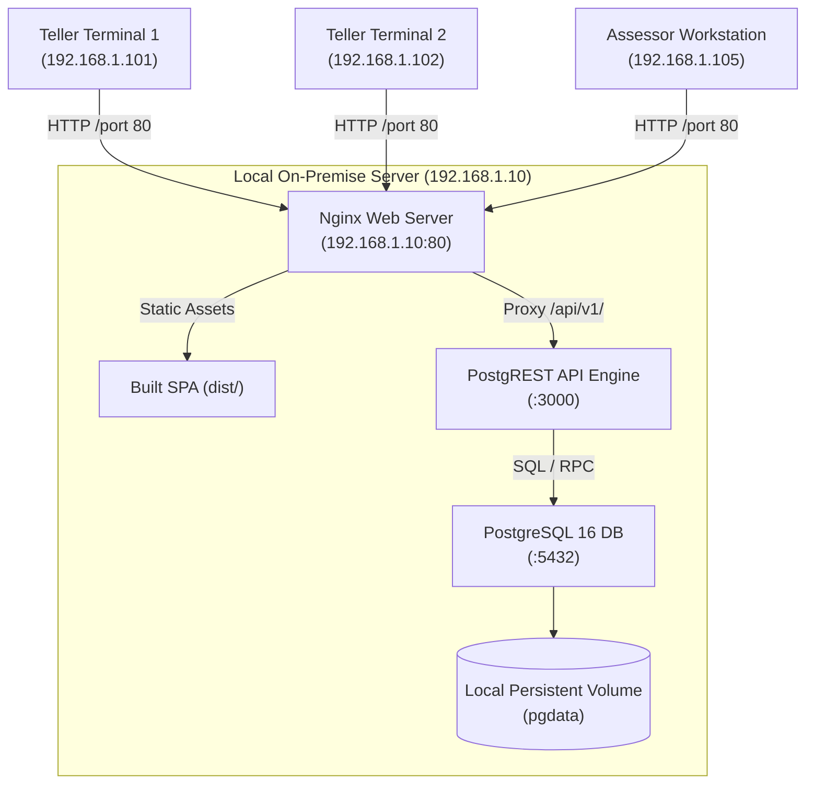

# On-Premise Deployment Guide — Air-Gapped Municipal Hall Setup
**LGU Treasury Connect — Real Property Tax Administration System (RPTAS)**  
**Municipality of Santa Rosa, Province of Nueva Ecija, Philippines**

---

## 1. Executive Summary

This guide outlines the procedure for deploying **LGU Treasury Connect** on a dedicated local physical server inside the Municipal Treasurer's Office of Santa Rosa, Nueva Ecija. This deployment operates completely disconnected from the public internet (air-gapped), fulfilling the strict data sovereignty and business continuity mandates of the Local Government Unit.

The system utilizes an architectural driver pattern (`ITreasuryRepository`) that can switch between **Cloud (Supabase)** and **Local On-Premise (PostgreSQL + PostgREST + Nginx)** with zero modifications to UI components.

---

## 2. Server Prerequisites

### 2.1 Minimum Hardware Specifications
* **Processor**: Intel Core i5 / Xeon (4 Cores, 2.5 GHz or higher)
* **Memory**: 8 GB RAM (16 GB recommended)
* **Storage**: 256 GB NVMe SSD (RAID 1 mirrored recommended for database fault tolerance)
* **Network**: Dual Gigabit Ethernet NIC (Internal Municipal Hall LAN)
* **Power**: Uninterruptible Power Supply (UPS) with at least 30 minutes battery backup

### 2.2 Software Environment
* **Operating System**: Ubuntu Server 22.04 LTS or 24.04 LTS (x86_64)
* **Container Engine**: Docker Engine v24.0+ & Docker Compose v2.20+
* **Firewall (UFW)**: Allow ports `80` (HTTP) and `3000` (API internal LAN)

---

## 3. Architecture Overview



---

## 4. Deployment Steps

### Step 1: Clone or Transfer Repository
Copy the release artifact to the on-premise server:
```bash
scp -r Municipal-Treasurers-Office-LGU.tar.gz admin@192.168.1.10:/opt/
ssh admin@192.168.1.10
cd /opt && tar -xzf Municipal-Treasurers-Office-LGU.tar.gz
cd Municipal-Treasurers-Office-LGU
```

### Step 2: Build Frontend for Local Environment
Create an `.env.local` configuration for building the frontend:
```env
VITE_BACKEND_DRIVER=local-http
VITE_API_BASE_URL=http://192.168.1.10/api/v1
```

Build the static bundle:
```bash
npm install
npm run build
```
*(The built production assets will be placed in `./dist`)*

### Step 3: Launch Containers via Docker Compose
Run Docker Compose in detached mode:
```bash
docker compose up -d
```

Verify that all three containers are healthy:
```bash
docker compose ps
```
Output:
```
NAME                    IMAGE                    STATUS                   PORTS
santa_rosa_rptas_db     postgres:16-alpine       Up (healthy)             0.0.0.0:5432->5432/tcp
santa_rosa_rptas_api    postgrest/postgrest:v12  Up                       0.0.0.0:3000->3000/tcp
santa_rosa_rptas_web    nginx:alpine             Up                       0.0.0.0:80->80/tcp
```

---

## 5. Daily Backup and COA Audit Archiving

In accordance with Commission on Audit (COA) Circulars on electronic records retention, perform automated daily database dumps at 5:00 PM:

```bash
# Add to crontab: crontab -e
0 17 * * 1-5 docker exec -t santa_rosa_rptas_db pg_dump -U treasury_admin rptas_treasury | gzip > /opt/backups/rptas_$(date +\%Y\%m\%d_\%H\%M).sql.gz
```

---

## 6. Verification and Troubleshooting

1. **Verify Database Initialization**:
   ```bash
   docker exec -it santa_rosa_rptas_db psql -U treasury_admin -d rptas_treasury -c "SELECT count(*) FROM properties;"
   ```
2. **Verify REST API**:
   ```bash
   curl -i http://localhost:3000/properties?limit=5
   ```
3. **Verify Web Interface**:
   Open a browser on any workstation connected to the Santa Rosa Municipal Hall LAN and navigate to:
   `http://192.168.1.10/`
