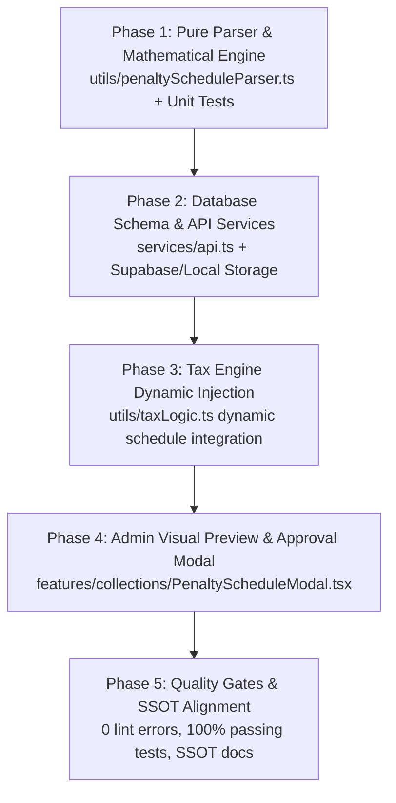

# Implementation Plan: Dynamic Delinquency Computation Schedule Ingestion (`COMPUTATION.csv`)

## Executive Summary
This document establishes the official implementation plan and phased engineering roadmap for dynamically importing Municipal Treasurer Notice of Delinquency computation sheets (`COMPUTATION...csv`) into **LGU Treasury Connect**.

Currently, the municipal delinquency schedule is statically defined in [`utils/taxLogic.ts`](file:///home/jeipyyy/Documents/Projects/Municipal-Treasurers-Office-LGU/utils/taxLogic.ts). When the Municipal Treasurer's Office updates the billing month schedule (e.g., transitioning from July to September or October), the Treasury Admin needs to import their official computation sheet (`COMPUTATION.csv`) to recalibrate system delinquency rates across all property billing and notice generation without requiring code changes or redeployment.

---

## Architectural Principles & Invariants

### 1. Dual-Mode Ingestion Engine
When Excel exports computation sheets without an active parcel assessed value, formula cells (`=L15*0.24`) export as dashes (` - `) or zeros rather than raw formula code. The engine handles this via two parsing modes:
1. **Mode A (Evaluated Numbers Present)**:  
   Directly extracts $\text{Rate} = \frac{\text{Penalties}}{\text{Unpaid Taxes}}$.
2. **Mode B (Blank Template / Dashes)**:  
   Extracts the effective billing date (`Date: SEPTEMBER 01-31 2026`) from the header and applies Santa Rosa's statutory rules:
   - Historical rolls ($\le 1993$): Legacy cap of `24.00%` (`0.24`).
   - General revision rolls past 36 months ($1994$–$2023$): Statutory cap of `72.00%` (`0.72`).
   - Recent years ($2024$ onwards): Elapsed month calculation ($(\text{Current Year} - \text{Roll Year}) \times 12 + \text{Month}$) $\times 2\%$.
   - Current active quarters ($2026\text{ 3-4 Q}$): `0.00%`.
   - Advance year ($2027$): Prompt discount `-20.00%` (`-0.20`).

Both modes produce the exact same verified schedule.

### 2. Historical Receipt Immortality (COA Audit Rule)
In compliance with Commission on Audit (COA) rules, updating the active schedule must **never** retroactively alter historical Official Receipts (AF-51) already issued in previous months. Schedules are stored with their effective month/year and historical timestamps.

---

## Phased Implementation Roadmap



### Phase 1: Pure Parser & Mathematical Engine (`utils/penaltyScheduleParser.ts`)
- Build an RFC 4180 compliant CSV parser specifically tuned for municipal Notice of Delinquency sheets.
- Implement **Signature Recognition**:
  - Validates `NOTICE OF DELIQUENCY IN THE PAYMENT OF REAL PROPERTY TAX`.
  - Extracts effective month and year from Row 7 (`Date: SEPTEMBER 01-31 2026` $\rightarrow$ Month: 9, Year: 2026).
- Implement **Dual-Mode Rate Extractor**:
  - Mode A (Populated): Parses `Unpaid Taxes` and `Penalties/Discount`, computes rate down to 4 decimal places.
  - Mode B (Template / Dashes): Calculates statutory elapsed months based on extracted billing date.
- Implement **Statutory Guardrails**:
  - Enforce RA 7160 Sec. 255 statutory cap: $\le 72.00\%$ (`0.72`).
  - Legacy roll cap: $\le 1993 \rightarrow 24.00\%$ (`0.24`).
  - Discount check: Only advance year rows may be negative (prompt discount $\le 20.00\%$).
- Comprehensive Vitest unit tests in `utils/penaltyScheduleParser.test.ts` covering:
  - July schedule (`COMPUTATION123 (2).csv`).
  - September schedule (`COMPUTATION123 (Sept).csv`).
  - Evaluated numerical CSV with AV = 100.
  - Corrupt or out-of-bounds CSV files (expecting clean error rejections).

### Phase 2: Schema, Persistence & API Abstraction (`services/api.ts`)
- Define TypeScript types in `types.ts`:
  - `PenaltyScheduleEntry`: `{ periodLabel: string; startYear: number; endYear: number; multiplier: number; penaltyRate: number; isDiscount: boolean; delinquentMonths: number }`.
  - `MunicipalPenaltySchedule`: `{ id: string; effectiveYear: number; effectiveMonth: number; label: string; rates: Record<string, number>; uploadedBy: string; uploadedAt: string; isActive: boolean }`.
- Create database schema in `schema.sql`:
  ```sql
  CREATE TABLE IF NOT EXISTS municipal_penalty_schedules (
    id UUID PRIMARY KEY DEFAULT gen_random_uuid(),
    effective_year INT NOT NULL,
    effective_month INT NOT NULL,
    schedule_label VARCHAR(64) NOT NULL,
    rates_json JSONB NOT NULL,
    uploaded_by UUID REFERENCES users(id),
    uploaded_at TIMESTAMPTZ DEFAULT NOW(),
    is_active BOOLEAN DEFAULT TRUE,
    created_at TIMESTAMPTZ DEFAULT NOW()
  );
  ```
- Implement API methods in `services/api.ts`:
  - `getActivePenaltySchedule()`: Retrieves currently active schedule, falls back gracefully to `SANTA_ROSA_MUNICIPAL_PENALTY_SCHEDULE`.
  - `savePenaltySchedule(schedule)`: Deactivates previous active schedule, inserts new one with audit record.
  - `getPenaltyScheduleHistory()`: Fetches past archived schedules for audit.

### Phase 3: Tax Calculation Engine Dynamic Injection (`utils/taxLogic.ts`)
- Update `calculatePropertyTax`:
  - Allow passing active penalty schedule via `TaxCalculationOptions.penaltyScheduleOverride?: Record<string, number>`.
  - If no override is provided, use default static `SANTA_ROSA_MUNICIPAL_PENALTY_SCHEDULE`.
- Guarantee zero regression on existing 35 unit tests in `utils/taxLogic.test.ts`.
- Add test cases verifying dynamic override produces exact custom outputs.

### Phase 4: Admin Visual Preview & Approval Modal (`PenaltyScheduleModal.tsx`)
- Build modern shadcn/ui modal with Emerald Treasury design tokens.
- Features:
  1. **Drag-and-Drop Area**: Accepts `.csv` files.
  2. **Automatic Signature Detection**: Displays "Verified Municipal Computation Sheet: September 2026".
  3. **Side-by-Side Comparison Table**:
     - Period / Year Bracket
     - Previous Active Rate (e.g. July 2026)
     - Incoming CSV Rate (e.g. September 2026)
     - Delta Highlight (e.g. `2024: 62% -> 66% (+4%)`)
  4. **Live Interactive Test Runner**:
     - Evaluates sample parcel at $\text{AV} = 100$ and $\text{AV} = 10,000$.
     - Proves bottom totals ($\text{Basic} = 82.61$, $\text{SEF} = 82.61$, $\text{Total} = 165.22$).
  5. **Role-Based Confirmation**: Only `Admin` or `Treasurer` role can click "Activate Schedule". Emits COA audit log.

### Phase 5: Verification & SSOT Alignment
- Update `docs/SSOT.md` Section 2.9 to document the dynamic schedule resolution pipeline.
- Verify repository with full quality gates:
  - `npx tsc --noEmit` $\rightarrow 0$ errors
  - `npm run lint` $\rightarrow 0$ errors, 0 warnings
  - `npm run test:unit` $\rightarrow 100\%$ pass
  - `npm run build` $\rightarrow$ Clean production bundle

---

## Proposed Changes Summary

| Component | File | Action | Purpose |
| :--- | :--- | :--- | :--- |
| **Parser Engine** | `utils/penaltyScheduleParser.ts` | **NEW** | Pure CSV parser & dual-mode statutory rate calculator |
| **Unit Tests** | `utils/penaltyScheduleParser.test.ts` | **NEW** | 100% test coverage on July/Sept schedules & error handling |
| **Tax Logic** | `utils/taxLogic.ts` | **MODIFY** | Accept `penaltyScheduleOverride` in calculation options |
| **Types** | `types.ts` | **MODIFY** | Add `MunicipalPenaltySchedule` interfaces |
| **Database** | `schema.sql` | **MODIFY** | Add `municipal_penalty_schedules` table |
| **API Client** | `services/api.ts` | **MODIFY** | Add get/save methods with persistent storage fallback |
| **UI Modal** | `features/collections/PenaltyScheduleModal.tsx` | **NEW** | Admin drag-drop preview, diff table, and activation |
| **Header** | `components/Header.tsx` | **MODIFY** | Add Penalty Schedule launcher button for Admin/Treasurer |
| **Bulk Import** | `features/properties/BulkImportModal.tsx` | **MODIFY** | Redirect user if they drop a computation CSV in parcel import |

---

## Verification Plan

### Automated Tests
1. **Type Checking**:
   ```bash
   npx tsc --noEmit
   ```
2. **Linting Verification**:
   ```bash
   npm run lint
   ```
3. **Unit Tests (Parser + Tax Engine)**:
   ```bash
   npm run test:unit
   ```
   Must pass all 35 tax tests + new penalty schedule parser tests.
4. **Production Build**:
   ```bash
   npm run build
   ```

### Manual & Visual Verification
1. Launch app with `npm run dev`.
2. Open **Penalty Schedule Modal** from the Treasury Settings / Header.
3. Drop `COMPUTATION123 (Sept).csv` and verify:
   - System displays: "Detected Schedule: SEPTEMBER 2026".
   - Comparison table shows correct rate deltas.
   - Simulation runner on $\text{AV} = 100$ matches Santa Rosa workbook ($\text{Basic} = 82.61$, $\text{SEF} = 82.61$, $\text{Total} = 165.22$).
4. Click "Confirm and Activate".
5. Verify delinquent property view uses the new rates immediately.
