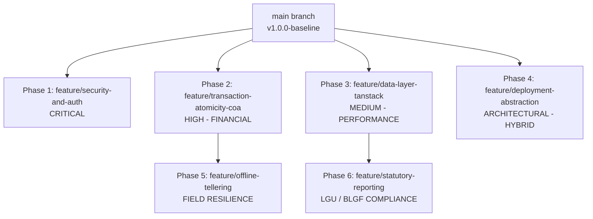
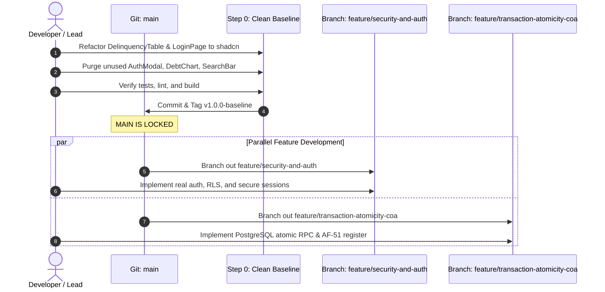

# LGU Treasury Connect — System Roadmap & Phase Execution Plan
**Municipality of Santa Rosa, Nueva Ecija — Real Property Tax Administration System**

---

## Executive Summary

This document establishes the official engineering roadmap for **LGU Treasury Connect**. It is governed by the Canonical Single Source of Truth ([`docs/SSOT.md`](file:///home/jeipyyy/Documents/Projects/LGU-Treasury-Connect/lgu-treasury-connect/docs/SSOT.md)) and the AI Agent Operating Protocol ([`AGENTS.md`](file:///home/jeipyyy/Documents/Projects/LGU-Treasury-Connect/lgu-treasury-connect/AGENTS.md)). It defines:
1. **Phase 0 (Locking `main`)**: Immediate cleanup and refactoring required to establish a stable, tested, zero-debt baseline on the `main` branch.
2. **Phases 1 through 6 (Feature Branches)**: Comprehensive architectural and operational features to branch out into, ordered by risk, statutory compliance, and operational necessity.



---

## Phase Matrix & Prioritization

| Phase | Branch Name | Priority | Category | Key Risk Addressed |
|---|---|---|---|---|
| **Phase 0** | `main` (direct) | **IMMEDIATE** | Code Hygiene & Design System | Incomplete UI refactoring, dead code, untagged baseline |
| **Phase 1** | `feature/security-and-auth` | **P0 (Critical)** | Security & RBAC | Plaintext passwords, fake session tokens, client-side-only RBAC |
| **Phase 2** | `feature/transaction-atomicity-coa` | **P0 (Financial)** | Financial Integrity & COA | Non-atomic payments, random receipt numbers, no void workflow |
| **Phase 3** | `feature/data-layer-tanstack` | **P1 (High)** | Architecture & Performance | `App.tsx` God Object, 7-second polling loop, memory bloat |
| **Phase 4** | `feature/deployment-abstraction` | **P1 (Architecture)**| Cloud vs. On-Premise | Vendor lock-in; hard coupling to Supabase PostgREST |
| **Phase 5** | `feature/offline-tellering` | **P2 (Operational)**| Resilience & Field Work | Network blackouts in provincial hall or offsite tax caravans |
| **Phase 6** | `feature/statutory-reporting` | **P2 (Compliance)** | Regulatory Compliance | Missing BLGF Form 3, Delinquency Notices, RPTAR Ledger printouts |

---

## Phase 0: Baseline Finalization (Locking `main`)

### Objective
Complete the current foundational sprint so that `main` is clean, all UI components use the unified shadcn/ui design system, dead code is purged, and the repository passes all tests and linting with zero warnings.

### Scope of Work
1. **Refactor Remaining UI Components to shadcn/ui**:
   - `components/DelinquencyTable.tsx`:
     - Replace custom HTML tables and raw checkboxes with `<Table>`, `<Badge>`, and `<Button>`.
     - Remove unused variable warnings (`summary`, `grandTotal`).
     - Fix `useEffect` dependency warnings.
   - `components/LoginPage.tsx`:
     - Modernize with `<Card>`, `<Input>`, `<Badge>`, and `<Button>`.
     - Remove unused Lucide icon imports and loose TypeScript `as any` casts.
2. **Purge Orphaned / Dead Code**:
   - Delete `components/AuthModal.tsx` *(superseded by `LoginPage.tsx`)*.
   - Delete `components/DebtChart.tsx` *(superseded by Recharts in `DashboardStats.tsx`)*.
   - Delete `components/SearchBar.tsx` *(superseded by inline search in `DashboardTable.tsx`)*.
3. **Verification Checklist**:
   - `npm run lint` $\rightarrow$ 0 errors, 0 warnings.
   - `npm run test:unit` $\rightarrow$ 5/5 passing RA 7160 tax logic tests.
   - `npm run build` $\rightarrow$ Successful production bundle.
4. **Git Action**:
   - Commit changes: `feat(foundation): modernize ui primitives, build system, and test suite`.
   - Tag release: `git tag -a v1.0.0-baseline -m "Baseline: shadcn design system, local tailwind, test suite"`.
   - Lock `main` branch against direct unreviewed commits.

---

## Phase 1: Security & Authentication Hardening

### Branch: `feature/security-and-auth`
**Priority**: Critical (P0)  
**Dependencies**: Phase 0 (`v1.0.0-baseline`)

### Problem Statement
1. **Plaintext Passwords**: `schema.sql` and `services/api.ts` store passwords in plaintext and authenticate using raw client string equality (`user.password !== password`).
2. **Fake Tokens**: The login function returns a mock token (`supabase-token-${user.id}`) that is unverified and stored in `localStorage`.
3. **Client-Only Authorization**: Roles (`Admin`, `Assessor`, `Viewer`) are enforced purely on the frontend by hiding buttons. Any user with the Supabase anon key can directly query or mutate `properties`, `users`, or `payment_postings` via PostgREST.

### Implementation Plan
1. **Authentication Engine**:
   - Option A (Supabase Cloud): Migrate to `supabase.auth.signInWithPassword` using native Supabase Auth with cryptographically signed JWTs and refresh tokens.
   - Option B (On-Premise / Custom DB): Implement PBKDF2/Bcrypt/Argon2 password hashing with HTTP-only session cookies and CSRF protection.
2. **Database Row-Level Security (RLS)**:
   - Enable RLS on all tables: `users`, `properties`, `payment_postings`, `schedule_of_market_values`, `rptar_audit_logs`.
   - Define policies binding actions to authenticated roles:
     - `Viewer`: `SELECT` on `properties`, `schedule_of_market_values`, `dashboard_stats`.
     - `Assessor`: `SELECT`, `INSERT`, `UPDATE` on `properties` and `payment_postings`.
     - `Admin`: Full CRUD on all tables including `users`.
3. **Session Management & Inactivity Timeout**:
   - Add idle session timeout (e.g., 15 minutes of inactivity auto-locks teller workstation).
   - Require password confirmation before destructive actions (deleting property or modifying assessed values).
4. **Security Audit Logging**:
   - Log all login attempts (success and failure), role changes, and access violations to an immutable security audit table.

### Acceptance Criteria
- [ ] No plaintext passwords exist in database or network payloads.
- [ ] Unauthorized REST requests using anon key fail with `401 Unauthorized` or `403 Forbidden`.
- [ ] Users automatically logged out after 15 minutes of inactivity.
- [ ] All RLS policies validated via automated integration tests.

---

## Phase 2: Financial Transaction Atomicity & COA Compliance

### Branch: `feature/transaction-atomicity-coa`
**Priority**: High / Financial (P0)  
**Dependencies**: Phase 0 (`v1.0.0-baseline`)

### Problem Statement
1. **Non-Atomic Payments**: `services/api.ts` issues payments across 3 separate HTTP calls (`properties.update` $\rightarrow$ `payment_postings.insert` $\rightarrow$ `rptar_audit_logs.insert`). A network interruption midway corrupts the ledger.
2. **Random Receipt Numbers**: OR numbers are generated via `Math.random()` (`AF51-2026-${Math.floor(1000 + Math.random() * 9000)}`). In Philippine LGUs, **Accountable Form 51 (AF-51)** receipts are strictly numbered booklets audited by the Commission on Audit (COA). Random numbers or missing serials trigger audit disallowances.
3. **Missing Void / Cancellation Workflow**: Tellering errors cannot be canceled with an audit trail, supervisor countersignature, and ledger rollback.

### Implementation Plan
1. **PostgreSQL Atomic Transaction Stored Procedure**:
   - Create a database stored procedure `process_rpt_payment(...)`:
     ```sql
     CREATE OR REPLACE FUNCTION process_rpt_payment(
       p_property_id INT,
       p_receipt_no TEXT,
       p_paid_records JSONB,
       p_total_paid NUMERIC,
       p_tender_type TEXT,
       p_tender_reference TEXT,
       p_posted_by TEXT,
       p_station_id TEXT
     ) RETURNS payment_postings AS $$
     BEGIN
       -- 1. Verify property exists and lock row
       PERFORM 1 FROM properties WHERE id = p_property_id FOR UPDATE;
       
       -- 2. Insert payment posting
       INSERT INTO payment_postings (...) VALUES (...);
       
       -- 3. Advance last_paid_year
       UPDATE properties SET last_paid_year = ..., updated_at = NOW() WHERE id = p_property_id;
       
       -- 4. Create immutable audit log
       INSERT INTO rptar_audit_logs (...) VALUES (...);
       
       RETURN ...;
     END;
     $$ LANGUAGE plpgsql;
     ```
2. **Accountable Form 51 Booklet Register**:
   - Create `accountable_forms` table tracking booklet stubs:
     - `booklet_id`, `form_type` ('AF-51'), `series_start`, `series_end`, `current_serial`, `assigned_to_user_id`, `status` ('ACTIVE', 'EXHAUSTED', 'REVOKED').
   - Concurrency lock (`SELECT ... FOR UPDATE`) to prevent duplicate serial issuance across parallel teller counters.
3. **Official Receipt Void / Cancellation Engine**:
   - Add status to `payment_postings`: `'ISSUED' | 'CANCELLED' | 'VOIDED'`.
   - Stored procedure `void_official_receipt(receipt_no, reason, authorized_by_admin)`:
     - Rolls back property's `last_paid_year` to previous state.
     - Marks OR as VOID (does not delete record; COA requires retaining voided receipts).
     - Logs supervisory cancellation audit trail.

### Acceptance Criteria
- [ ] Payment processing is 100% atomic: simulated network disconnect never leaves orphaned records.
- [ ] AF-51 receipt numbers are sequential without duplicates or random generation.
- [ ] Tellers cannot issue receipts without an active assigned booklet stub.
- [ ] Voided receipts preserve historical records and roll back property tax liability.

---

## Phase 3: Data Layer Optimization, Assessor Import Center & Municipal Tax Policy

### Branch: `feature/data-layer-tanstack`
**Priority**: High (P1)  
**Dependencies**: Phase 0 (`v1.0.0-baseline`), Phase 1, Phase 2

### Problem Statement
1. **`App.tsx` Monolith**: Global state, modals, filters, and records lack query caching and structured server sync.
2. **7-Second Polling Loop**: Inefficient continuous polling creates unnecessary database queries.
3. **Full Table Scans**: Fetches all properties into client memory at once without server-side pagination.
4. **Fragile CSV Import**: Lacks smart upsert by `td_number`, overwrites or rejects existing parcel uploads, and lacks staging preview by barangay across Santa Rosa's 33 barangays.
5. **Rigid Tax Discounts**: Discounts are hardcoded rather than driven by municipal tax-policy settings, and authorized assessors cannot perform audited manual adjustments.

### Implementation Plan
1. **Assessor Import Center & Smart Barangay Upsert**:
   - Dedicated workspace view with upload history, batch review, and diff preview.
   - Master key: `td_number`. Smart upsert updates existing properties, inserts new parcels, and preserves unmentioned records.
   - Financial history protection: Ingestion **never** alters `last_paid_year` or payment history.
   - Explicit row states: `VALID_NEW`, `VALID_UPDATE`, `UNCHANGED`, `DUPLICATE_IN_FILE`, `INVALID_TD`, `INVALID_BARANGAY`, `INVALID_PROPERTY_CLASS`, `INVALID_NUMERIC_VALUE`, `CONFLICTING_RECORD`.
   - Idempotent execution: Repeated uploads of identical CSV rows produce 0 spurious database writes.
   - Santa Rosa 33-Barangay template generator with authentic parcel samples.
2. **Municipal Tax-Policy Discounts & Assessor Overrides**:
   - Database-backed `municipal_tax_settings`:
     - `early_payment_discount_rate = 20%` (Jan 1 – Mar 31).
     - `regular_prompt_discount_rate = 10%` (Apr 1 – Dec 31).
     - `delinquent_discount_rate = 0%` (strictly non-discountable).
     - **Note**: The 10% rate is a **payment-date-based discount policy**, NOT a quarterly discount.
   - UI displays system-calculated defaults alongside authorized editable inputs for `Basic Tax`, `SEF Tax`, and `Discount Rate`.
   - Dynamic derived calculation of `Discount Amount` and `Net Amount Due`.
   - Field-level audit trail in `rptar_audit_logs` tracking old/new values, differences, user identity, and mandatory adjustment reasons.
   - Payment snapshot: Posted payments lock in final applied values immutably.
3. **TanStack Query Setup & Realtime WebSockets**:
   - Install `@tanstack/react-query` and create query hooks (`useProperties`, `usePropertyAssessment`, `useDashboardStats`).
   - Replace 7-second polling loop with Supabase Realtime WebSocket listeners.
4. **Server-Side Pagination & Search**:
   - Paginated endpoints (limit/offset) and debounced search (300ms) to support 25,000+ Santa Rosa parcels effortlessly.

### Acceptance Criteria
- [ ] January–March payments apply 20% default discount; April–December payments apply 10% default discount; delinquent years apply 0%.
- [ ] Authorized Assessors can edit Basic Tax, SEF Tax, or Discount Rate, instantly recalculating the Net Amount Due.
- [ ] Every manual field change creates an individual field-level audit entry in `rptar_audit_logs`.
- [ ] Posted payment snapshots final applied values and resists retroactive modification from subsequent policy changes.
- [ ] Smart upsert matches on `td_number`, accurately classifying rows into valid states, without altering financial payment history.
- [ ] Idempotent CSV re-upload creates zero unnecessary updates.
- [ ] Polling `setInterval` completely removed in favor of Supabase Realtime WebSockets.

---

## Phase 4: Deployment Abstraction (Cloud vs. On-Premise)

### Branch: `feature/deployment-abstraction`
**Priority**: Architectural (P1)  
**Dependencies**: Phase 0 (`v1.0.0-baseline`)

### Problem Statement
The application is currently hardwired to `@supabase/supabase-js`. If the Municipal Government decides to deploy on a local in-house server (air-gapped local PostgreSQL inside the Santa Rosa Municipal Hall), the entire frontend would require invasive modifications.

### Implementation Plan
1. **Repository Pattern (Hexagonal / Clean Architecture)**:
   - Define a pure TypeScript interface `ITreasuryRepository`:
     ```typescript
     export interface ITreasuryRepository {
       getProperties(params: GetPropertiesParams): Promise<PaginatedResult<Property>>;
       getPropertyById(id: string): Promise<Property>;
       getAssessment(propertyId: string): Promise<CalculationResult>;
       processPayment(payload: PaymentPayload): Promise<OfficialReceipt>;
       voidReceipt(receiptNo: string, reason: string): Promise<void>;
       getAuditLogs(params: AuditFilterParams): Promise<RptarAuditLog[]>;
       getDashboardStats(): Promise<DashboardStatsData>;
       login(credentials: LoginCredentials): Promise<AuthSession>;
     }
     ```
2. **Multiple Driver Implementations**:
   - `SupabaseRepository`: Uses `@supabase/supabase-js` for Supabase Cloud hosting.
   - `LocalHttpRepository`: Uses standard `fetch` / `axios` communicating with an On-Premise REST backend (e.g. FastAPI / Express / Go running on the local municipality server).
3. **Driver Factory & Environment Configuration**:
   - Switch via `.env`:
     ```env
     VITE_BACKEND_DRIVER=supabase # or 'local-http'
     VITE_API_BASE_URL=http://192.168.1.100:8000/api/v1
     ```
4. **On-Premise Server Package (Docker Compose)**:
   - Provide a complete `docker-compose.yml` with:
     - PostgreSQL 16 (with schema migrations).
     - Lightweight API server.
     - Nginx reverse proxy serving built static frontend.

### Acceptance Criteria
- [ ] Frontend operates seamlessly regardless of whether `VITE_BACKEND_DRIVER` is set to `supabase` or `local-http`.
- [ ] Zero Supabase client code leaking into UI components.
- [ ] Docker Compose bundle deployable on a single offline local server inside Santa Rosa Municipal Hall.

---

## Phase 5: Offline Resilience & Field Tellering

### Branch: `feature/offline-tellering`
**Priority**: Operational (P2)  
**Dependencies**: Phase 2 (`feature/transaction-atomicity-coa`), Phase 4 (`feature/deployment-abstraction`)

### Problem Statement
Provincial LGUs frequently encounter internet fiber cuts, typhoon power outages, and dispatch tax collectors to distant barangays for mobile collection caravans with zero cellular coverage. Tellers cannot halt collections when the internet disconnects.

### Implementation Plan
1. **Client-Side Storage (IndexedDB via Dexie.js)**:
   - Cache barangay properties, tax rates, and SFMV tables locally in the browser.
2. **Offline Outbox Pattern**:
   - Store offline payments in an IndexedDB `pending_payments` queue.
   - Offline receipt issuance assigns pre-allocated offline booklet serials reserved for that specific mobile station.
3. **Background Sync & Conflict Resolution**:
   - Service Worker / Online Listener detects reconnection.
   - Automatically replays pending transactions to the server sequentially.
   - Flags any conflicting modifications for supervisory review.

### Acceptance Criteria
- [ ] System remains fully operational for assessment lookup and receipt issuance when internet is completely disconnected.
- [ ] Queued receipts sync automatically to the master database upon reconnection.
- [ ] No duplicate serial numbers or lost transaction data during network transitions.

---

## Phase 6: Regulatory Reporting & Statutory Compliance

### Branch: `feature/statutory-reporting`
**Priority**: Compliance (P2)  
**Dependencies**: Phase 2 (`feature/transaction-atomicity-coa`), Phase 3 (`feature/data-layer-tanstack`)

### Problem Statement
Treasury operations require statutory reports mandated by the **Bureau of Local Government Finance (BLGF)** and **Commission on Audit (COA)**. Currently, the system only outputs the single AF-51 receipt printout.

### Implementation Plan
1. **BLGF Form 3 (Monthly Collection Report)**:
   - Generates the official BLGF monthly report breakdown:
     - Gross Basic Tax vs. Special Education Fund (SEF).
     - Current Year vs. Prior Years (Delinquent) Collections.
     - Penalties / Surcharges collected.
     - Advance payment discounts granted.
2. **Notice of Delinquency (RA 7160 Sec. 254)**:
   - Batch generator for official demand letters to delinquent property owners.
   - Formatted with Santa Rosa municipal seal, statutory interest escalation warnings, and legal remedies (warrant of levy).
   - Printable in batch format for postal delivery.
3. **RPTAR Continuous Ledger Sheet**:
   - Generates official Real Property Tax Account Register ledger cards per Tax Declaration.
4. **Export Formats**:
   - High-fidelity print preview (`@media print` CSS / `@react-pdf/renderer`).
   - Excel (`.xlsx`) and CSV exports for LGU accounting systems.

### Acceptance Criteria
- [ ] BLGF Form 3 matches Philippine Treasury accounting standards to the centavo.
- [ ] Notice of Delinquency letters generate cleanly in bulk with proper page breaks and municipal branding.
- [ ] Exports load accurately into Excel and municipal financial ledgers.

---

## Recommended Execution Workflow



### Next Immediate Action:
Execute **Phase 0** right now:
1. Refactor `DelinquencyTable.tsx` to shadcn primitives.
2. Refactor `LoginPage.tsx` to shadcn primitives.
3. Remove `AuthModal.tsx`, `DebtChart.tsx`, `SearchBar.tsx`.
4. Run `npm run lint` and `npm run test:unit`.
5. Commit and tag `v1.0.0-baseline`.
