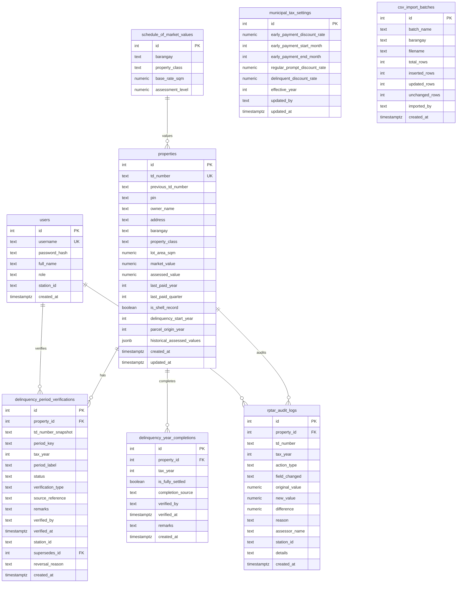

# Real Property Tax Delinquency Verification & Statement System — Single Source of Truth (SSOT)
**System Specification & Canonical Architecture Document**  
**Municipality of Santa Rosa, Nueva Ecija**

---

## 1. Document Control & System Identity

| Property | Canonical Specification |
|---|---|
| **System Name** | Real Property Tax Delinquency Verification & Statement System |
| **Document Purpose** | Single Source of Truth (SSOT) governing all property assessment rolls, historical valuation provenance, statutory delinquency calculations under RA 7160, delinquency-period verification, external settlement evidence references, Statement of Account (SOA), Notice of Delinquency (Sec. 254), and conditional tax-clearance eligibility for the Municipality of Santa Rosa, Nueva Ecija. |
| **Jurisdiction** | Municipality of Santa Rosa, Province of Nueva Ecija, Region III, Philippines |
| **Statutory Framework** | Republic Act No. 7160 (Local Government Code of 1991, Title II), Provincial Tax Ordinance of Nueva Ecija, Municipal Revenue Code of Santa Rosa |
| **Current Baseline** | v1.0.0 (Vite + React 18 + TypeScript + Local Tailwind CSS + shadcn/ui + Vitest) |
| **Plan Companion** | [`IMPLEMENTATION_PLAN_VERIFICATION_STATEMENT_SYSTEM.md`](file:///home/jeipyyy/Documents/Projects/Municipal-Treasurers-Office-Delinquency-System/Municipal-Treasurers-Office-Delinquency-System/docs/IMPLEMENTATION_PLAN_VERIFICATION_STATEMENT_SYSTEM.md) |

---

## 2. Statutory Business & Tax Calculation Rules

All tax calculations in the system must strictly adhere to RA 7160 Title II. These rules are verified by unit tests in [`utils/taxLogic.test.ts`](file:///home/jeipyyy/Documents/Projects/LGU-Treasury-Connect/lgu-treasury-connect/utils/taxLogic.test.ts).

### 2.1 Tax Rates & Allocation
- **Current Operational Year**: `2026` (`CURRENT_YEAR = 2026`).
- **Base Real Property Tax (RPT) Rate**: `2.00%` (`0.02`) of Assessed Value:
  - **Basic Tax**: `1.00%` (`0.01`) allocated to the General Fund of the Municipality and Barangays (RA 7160 Sec. 233).
  - **Special Education Fund (SEF)**: `1.00%` (`0.01`) allocated exclusively to the Local School Board (RA 7160 Sec. 235).

$$\text{Base Tax} = \text{Assessed Value} \times 0.02 = \text{Basic Tax (1\%)} + \text{SEF Tax (1\%) }$$

### 2.2 Property Valuation Formulas
- **Market Value (MV)**: Determined from the Schedule of Market Values (SFMV) based on lot area, classification, and barangay base rates.
  $$\text{Market Value} = \text{Lot Area (sqm)} \times \text{Base Rate per sqm}$$
- **Assessed Value (AV)**: Taxable base derived by applying statutory Assessment Levels (AL):
  $$\text{Assessed Value} = \text{Market Value} \times \text{Assessment Level}$$
- **Canonical Property Classes & Statutory Assessment Levels**:
  - `Residential`: `20%` (0.20)
  - `Agricultural`: `40%` (0.40)
  - `Industrial`: `50%` (0.50)
  - `Machinery`: `80%` (0.80)
  - `Dwell House`: Scaled based on value tiers (default `20%`)

### 2.3 Delinquency Penalties (Surcharges)
- **Accrual Rate**: `2%` per month of delay (`PENALTY_RATE_PER_MONTH = 0.02`) (RA 7160 Sec. 255).
- **Statutory Penalty Cap**: Maximum of `36 months` (`MAX_PENALTY_MONTHS = 36`), capping modern annual surcharges at **`72%`** (`0.72`) of the delinquent base tax.
- **Municipal Assessment Era Penalty Schedule (Santa Rosa Treasury)**: Under Santa Rosa Treasury's canonical spreadsheet engine:
  - **Pre-1994 Historical Eras (`1973-79` through `1992-1993`)**: Fixed municipal legacy rate of **`24%`** (`0.24`).
  - **1994 Revision Era through Modern Rolls (`1994-2005`, `2006-11`, and `2012` to `2023`)**: Statutory maximum cap of **`72%`** (`0.72` / 36 months).
  - **Recent Delinquent Rolls**:
    - `2024`: **`66%`** (`0.66` / 33 months)
    - `2025`: **`42%`** (`0.42` / 21 months)
    - `2026 1-2Q`: **`18%`** (`0.18` / 9 months)
  - **Prompt & Advance Windows**:
    - `2026 3-4 Q`: **`0%`** penalty (eligible for 10% prompt discount in Q3/Q4)
    - `2027`: **`-20%`** advance prompt discount
- **Accrual Start**: Past delinquent years accrue from January 1 of that tax year. Current year liabilities accrue penalty quarterly or after statutory deadlines.

$$\text{Effective Delay Months} = \min(\text{Months Delayed}, 36)$$
$$\text{Penalty Rate} = \text{Effective Delay Months} \times 0.02 \quad (\text{or } 0.24 \text{ for years } \le 1993)$$
$$\text{Penalty Amount} = \text{Base Tax} \times \text{Penalty Rate}$$
$$\text{Total Year Liability} = \text{Base Tax} + \text{Penalty Amount} - \text{Discounts}$$

### 2.4 Payment-Date-Based Discounts (Municipal Tax Policy)
Discounts apply strictly based on the **payment date** for the current tax year (and advance payments).
> [!IMPORTANT]
> **Payment-Date-Based Policy**: The 10% rate is a **payment-date-based discount policy** (April 1 to December 31), NOT a quarterly discount, unless the system is formally expanded to true quarter-level accounting.
- **Default Rates & Windows**:
  - **January 1 – March 31**: Default discount is **`20%`** (`early_payment_discount_rate = 0.20`).
  - **April 1 – December 31**: Default discount is **`10%`** (`regular_prompt_discount_rate = 0.10`).
  - **Delinquent Prior-Year Obligations**: Default discount is strictly **`0%`** (`delinquent_discount_rate = 0.00`). Under RA 7160, discounts apply **only** to the current or advance year, never to delinquent prior-year liabilities.
- **Configurable Tax Policy**:
  - These percentages must NOT be permanently hardcoded. They are stored in `municipal_tax_settings` and auto-populate based on payment date and delinquency status.

### 2.5 Authorized Assessor Manual Overrides & Real-Time Recalculation
Authorized Assessors have statutory discretion to manually adjust populated tax fields:
- **Editable Fields**:
  1. `Basic Tax` (PHP)
  2. `SEF Tax` (PHP)
  3. `Discount Rate` (%)
- **System Default Display**: The UI must display the system-calculated default value alongside the editable input so that discrepancies remain clear.
- **Immediate Recalculation**:
  - Changing Basic Tax, SEF Tax, or Discount Rate immediately recalculates:
    $$\text{Eligible Tax Base} = \text{Basic Tax} + \text{SEF Tax}$$
    $$\text{Discount Amount} = \text{Eligible Tax Base} \times \text{Discount Rate}$$
    $$\text{Net Amount Due} = \text{Eligible Tax Base} + \text{Penalty Amount} - \text{Discount Amount}$$
  - **Non-Free Entry for Discount Amount**: `Discount Amount` is always mathematically derived from the applied discount rate and eligible tax base; it cannot be an independent free-text entry.
  - **Preservation of System Defaults**: Manual edits must NOT silently overwrite original calculated values or alter the underlying statutory rate configuration.

### 2.6 Field-Level Audit Trail (`rptar_audit_logs`)
Every manual modification to `Basic Tax`, `SEF Tax`, or `Discount Rate` creates an individual field-level audit record. Generic "assessment modified" entries are strictly prohibited.
- **Preserved Audit Fields**:
  - `property_id` & `td_number`
  - `tax_year`
  - `field_changed` (`BASIC_TAX`, `SEF_TAX`, `DISCOUNT_RATE`)
  - `original_value` (system-calculated default)
  - `new_value` (assessor-applied value)
  - `difference` (`new_value - original_value`)
  - `user_id` / `user_name` & `user_role`
  - `station_id` (workstation identifier)
  - `reason` (mandatory assessor justification)
  - `created_at` (audit timestamp)

### 2.7 "Arrears First" Sequential Verification Rule
- Taxpayers **cannot** have current year (2026) dues cleared or verified while delinquent prior-year liabilities remain unverified or unsettled.
- Verification and statement scopes must be applied strictly in chronological order starting from the earliest unpaid year ($\text{lastPaidYear} + 1$).
- Authorized Assessors may verify 1 Quarter, 1 Year, or Full Payoff, but selection must anchor on the oldest unpaid record.

### 2.8 Shell Records Rule
- Properties flagged as `is_shell_record = true` represent historical, unverified, or fragmented legacy parcels lacking a verified Tax Declaration (TD) Number or Property Identification Number (PIN).
- **Verification Prohibition**: Shell records **cannot** have delinquency verified or Tax Clearance Certificates issued until formally verified, updated with SFMV rates, and certified by the Municipal Assessor.

### 2.9 Statutory Notice of Delinquency (RA 7160 Sec. 254 Specification)
Under **Section 254 of Republic Act No. 7160 (Local Government Code of 1991)**, when real property tax becomes delinquent, the local treasurer must issue a formal Notice of Delinquency. The canonical Santa Rosa Notice of Delinquency document structure, period aggregation brackets, and signatory specifications are codified below:

#### 2.9.1 Header & Legal Mandate
- **Jurisdiction**: 
  ```text
  REPUBLIC OF THE PHILIPPINES
  PROVINCE OF NUEVA ECIJA
  Office of the Treasurer
  Municipality of Santa Rosa
  ```
- **Document Title**: `NOTICE OF DELINQUENCY IN THE PAYMENT OF REAL PROPERTY TAX`
- **Statutory Notice Text**:
  > *"Notice is hereby served pursuant to the provision of Section 254, Republic Act No. 7160 (Local Government Code of 1991) the Real Property Tax for Calendar year 2025 and the previous years, has been delinquent with the respect to the figures."*
- **Audit References**:
  - `OR#`: Number of latest external Official Receipt or settlement document
  - `LAST PAYMENT:`: Date and details of last recorded settlement
  - `Notice Serving Period`: Current tax operations window (e.g. `SEPTEMBER 01-31, 2026`)

#### 2.9.2 Property & Valuation Headers
1. `Tax Declaration No.` (Current and previous TD reference)
2. `Area` (Land area in square meters / hectares)
3. `Assessed Value` (Taxable base in PHP)
4. `Location` (Barangay and street location)
5. `Kind of Property` (Classification: Residential, Agricultural, Commercial, Industrial, Machinery)

#### 2.9.3 Historical Delinquency Period Groupings (Canonical Roll Brackets)
To administer multi-decade delinquent arrears without document truncation, Santa Rosa Treasury codifies historical assessment eras into standard municipal aggregation brackets:

| Period / Year Range | Bracket Type | Statutory / Historical Assessment Context |
|---|---|---|
| `1973-79` | Multi-Year Aggregate | Presidential Decree No. 464 (Real Property Tax Code of 1974) Enactment Era |
| `1980-85` | Multi-Year Aggregate | Early 1980s General Assessment Revision Roll |
| `1986` | Single Year | 1986 Constitutional Transition Period |
| `1987-1991` | Multi-Year Aggregate | Late Pre-Local Government Code Roll |
| `1992-1993` | Multi-Year Aggregate | RA 7160 Initial Enactment Period |
| `1994-2005` | Multi-Year Aggregate | 1994 General Revision Era (12-year valuation block) |
| `2006-11` | Multi-Year Aggregate | 2006 General Revision Era (6-year valuation block) |
| `2012` to `2025` | Annual Itemized | Individual modern calendar assessment rolls |
| `2026 1-2Q` | Semi-Annual Quarter Split | Overdue / Delinquent quarters of the operational year (Q1 & Q2) |
| `2026 3-4 Q` | Semi-Annual Quarter Split | Current / Prompt payment quarters of the operational year (Q3 & Q4) |
| `2027` | Annual Advance | Advance assessment year (eligible for advance prompt discount) |

#### 2.9.4 Period Columnar Computation Rules & Municipal Penalty Schedule
For each period or aggregated bracket above, calculations are governed by the official Santa Rosa Municipal Treasurer Notice of Delinquency schedule (matching workbook tab `SEP`):

| Period / Roll Bracket | Multiplier / Span | Unpaid Taxes Formula (Per Fund) | Municipal Penalty / Discount Rate | Net Total Delinquency (Per Fund) |
|---|---|---|---|---|
| `1973-79` | 7 Years | `(Assessed Value * 0.01) * 7` | `+24%` (`0.24`) | `Unpaid Taxes + (Unpaid Taxes * 0.24)` |
| `1980-85` | 6 Years | `(Assessed Value * 0.01) * 6` | `+24%` (`0.24`) | `Unpaid Taxes + (Unpaid Taxes * 0.24)` |
| `1986` | 1 Year | `(Assessed Value * 0.01) * 1` | `+24%` (`0.24`) | `Unpaid Taxes + (Unpaid Taxes * 0.24)` |
| `1987-1991` | 5 Years | `(Assessed Value * 0.01) * 5` | `+24%` (`0.24`) | `Unpaid Taxes + (Unpaid Taxes * 0.24)` |
| `1992-1993` | 2 Years | `(Assessed Value * 0.01) * 2` | `+24%` (`0.24`) | `Unpaid Taxes + (Unpaid Taxes * 0.24)` |
| `1994-2005` | 12 Years | `(Assessed Value * 0.01) * 12` | `+72%` (`0.72` max statutory) | `Unpaid Taxes + (Unpaid Taxes * 0.72)` |
| `2006-11` | 6 Years | `(Assessed Value * 0.01) * 6` | `+72%` (`0.72` max statutory) | `Unpaid Taxes + (Unpaid Taxes * 0.72)` |
| `2012` to `2023` | 1 Year each | `(Assessed Value * 0.01) * 1` | `+72%` (`0.72` max per year) | `Unpaid Taxes + (Unpaid Taxes * 0.72)` |
| `2024` | 1 Year | `(Assessed Value * 0.01) * 1` | `+66%` (`0.66` / 33 months) | `Unpaid Taxes + (Unpaid Taxes * 0.66)` |
| `2025` | 1 Year | `(Assessed Value * 0.01) * 1` | `+42%` (`0.42` / 21 months) | `Unpaid Taxes + (Unpaid Taxes * 0.42)` |
| `2026 1-2Q` | Half Year (0.5) | `(Assessed Value * 0.01) * 0.5` | `+18%` (`0.18` / 9 months) | `Unpaid Taxes + (Unpaid Taxes * 0.18)` |
| `2026 3-4 Q` | Half Year (0.5) | `(Assessed Value * 0.01) * 0.5` | `None` (`0%` / prompt window) | `Unpaid Taxes - Prompt Discount` |
| `2027` | 1 Year | `(Assessed Value * 0.01) * 1` | `-20%` (`0.20` advance discount) | `Unpaid Taxes - (Unpaid Taxes * 0.20)` |

> [!IMPORTANT]
> **Santa Rosa Municipal Delinquency Protocol & Fund Balancing**:
> 1. **Table Rows (Single Fund Base)**: Each row in the Notice of Delinquency itemizes the 1% tax base ($\text{Assessed Value} \times 0.01 \times \text{Multiplier}$) and its statutory surcharge or prompt discount.
> 2. **Accountable Totals (Rows 40–42)**:
>    - `BASIC`: The sum of the itemized table column (`Total Tax Delinquency`), allocated to the General Fund.
>    - `SEF`: An equal, identical amount allocated to the Special Education Fund (Local School Board).
>    - `TOTAL`: The grand total payable by the taxpayer ($\text{BASIC} + \text{SEF} = 2 \times \text{Table Column Sum}$).

#### 2.9.5 Mandatory Accountable Totals & Signatories
- **Summary Totals**:
  - `BASIC`: Total Basic Tax (1% General Fund)
  - `SEF`: Total Special Education Fund (1% Local School Board)
  - `TOTAL`: Grand Total Tax Delinquency
- **Canonical Signatories**:
  - **Prepared by**: `Revenue Collection Clerk`
  - **Received by**: `Signature over printed name & Date` (Taxpayer / Owner acknowledgment)
  - **Approved by / Municipal Treasurer**: `Myra V. Cunanan, Municipal Treasurer`

---

## 3. Canonical Data Architecture & Schemas

The database schema must adhere to this unified specification across Supabase Cloud and On-Premise PostgreSQL.



### 3.1 Strict Field Mapping & Conventions

| Entity | PostgreSQL Column (`snake_case`) | TypeScript Property (`camelCase`) | Type | Nullable | Notes |
|---|---|---|---|---|---|
| **Property** | `id` | `id` | `string` / `number` | No | Primary Key |
| | `td_number` | `tdNumber` | `string` | No | Unique Tax Declaration No. |
| | `previous_td_number` | `previousTdNumber` | `string` | Yes | Prior cancelled TD |
| | `pin` | `pin` | `string` | Yes | Property Identification No. |
| | `owner_name` | `ownerName` | `string` | No | Declared Owner |
| | `address` | `address` | `string` | No | Property location |
| | `barangay` | `barangay` | `string` | No | One of 33 Santa Rosa barangays |
| | `property_class` | `propertyClass` | `string` | No | Residential, Agricultural, etc. |
| | `lot_area_sqm` | `lotAreaSqm` | `number` | Yes | Area in square meters |
| | `market_value` | `marketValue` | `number` | No | Total Market Value (PHP) |
| | `assessed_value` | `assessedValue` | `number` | No | Total Taxable Assessed Value |
| | `last_paid_year` | `lastPaidYear` | `number` | No | Default `2025` |
| | `last_paid_quarter` | `lastPaidQuarter` | `number` | No | Default `4` |
| | `is_shell_record` | `isShellRecord` | `boolean` | No | Default `false` |
| | `historical_assessed_values` | `historicalAssessedValues` | `Record<string, HistoricalAssessedValueItem>` | Yes | Era valuation overrides |
| **Delinquency Verification** | `id` | `id` | `number` | No | Primary Key |
| | `property_id` | `propertyId` | `number` | No | Foreign Key $\rightarrow$ `properties.id` |
| | `td_number_snapshot` | `tdNumberSnapshot` | `string` | No | Snapshot of TD Number at verification |
| | `period_key` | `periodKey` | `string` | No | Period bracket identifier (e.g. `2024`, `1994-2005`) |
| | `tax_year` | `taxYear` | `number` | No | Assessment calendar year |
| | `period_label` | `periodLabel` | `string` | No | Human-readable period label |
| | `status` | `status` | `DelinquencyPeriodStatus` | No | Verification lifecycle state |
| | `verification_type` | `verificationType` | `VerificationType` | No | Evidence type (OFFICIAL_RECEIPT, CERTIFICATE, etc.) |
| | `source_reference` | `sourceReference` | `string` | Yes | External receipt #, check #, certificate # |
| | `remarks` | `remarks` | `string` | Yes | Assessor remarks and audit notes |
| | `verified_by` | `verifiedBy` | `string` | No | Assessor name/identifier |
| | `verified_at` | `verifiedAt` | `string` (ISO 8601) | No | Timestamp of verification |
| | `supersedes_id` | `supersedesId` | `number` | Yes | Pointer to superseded prior verification |
| | `reversal_reason` | `reversalReason` | `string` | Yes | Reason for supervisory reversal |

### 3.2 Assessor Import Center & Smart Barangay Upsert Specification
The system supports continuous ingestion of property rolls categorized across Santa Rosa's 33 barangays:
1. **Unique Identification**: `td_number` is the definitive master key.
2. **Smart Upsert (Last-Write-Wins per TD)**:
   - If incoming row matches an existing `td_number` in the database, update property details (owner, address, classification, valuations) with newer data.
   - If incoming row does not exist, insert it as a new property.
   - Preserves unmentioned properties in that barangay.
3. **Assessment History Protection (INVARIANT)**:
   - Bulk CSV imports must **never** silently reset independently verified delinquency statuses or settlement audit trails (`delinquency_period_verifications`, `rptar_audit_logs`).
4. **Staging Workflow**:
   $$\text{Upload} \longrightarrow \text{Validate} \longrightarrow \text{Stage} \longrightarrow \text{Review/Diff} \longrightarrow \text{Authorize} \longrightarrow \text{Atomic Upsert} \longrightarrow \text{Audit Log} \longrightarrow \text{Batch History}$$
5. **Row Validation States**:
   - `VALID_NEW`: Completely new parcel ready for insertion.
   - `VALID_UPDATE`: Existing parcel with modified data ready for update.
   - `UNCHANGED`: Identical record; skipped to ensure idempotency.
   - `DUPLICATE_IN_FILE`: Repeated TD within the same CSV upload.
   - `INVALID_TD`: Missing or malformed Tax Declaration Number.
   - `INVALID_BARANGAY`: Barangay not in canonical list of 33 Santa Rosa barangays.
   - `INVALID_PROPERTY_CLASS`: Class not in canonical SFMV classes.
   - `INVALID_NUMERIC_VALUE`: Negative, NaN, or corrupted market/assessed value.
   - `CONFLICTING_RECORD`: Parcel exhibits conflicting ownership or boundary constraints.
6. **Idempotency**: Re-uploading an identical CSV produces zero spurious updates or duplicate audit noise.

---

## 4. Delinquency Verification, External Settlement Evidence, and Tax Clearance Protocols

The system functions strictly as an assessment verification, delinquency auditing, and statement generation engine. Direct cash collection, physical receipt issuance, and cashiering have been decoupled from this system boundary.

### 4.1 Delinquency-Period Verification Lifecycle
Each historical and modern tax period is governed by a formal lifecycle state:
- `UNVERIFIED`: Insufficient evidence; default unconfirmed assessment state.
- `VERIFIED_OUTSTANDING`: Statutory liability determined; confirmed delinquent and outstanding.
- `VERIFIED_SETTLED_EXTERNALLY`: Confirmed settled outside this system via authenticated Treasury evidence.
- `DISPUTED`: Conflicting documentary evidence or taxpayer boundary/assessment dispute under review.
- `NOT_APPLICABLE`: No tax liability exists for this parcel in the designated period.
- `SUPERSEDED`: Prior verification decision replaced by a newer authorized administrative correction.

### 4.2 External Settlement Evidence Standards
When recording settlement for a tax period, authorized assessors must record reference evidence:
1. **Source Reference**: External Official Receipt (AF-51) number, Certificate of Settlement reference, Land Bank check/deposit serial, or physical RPTAR ledger page.
2. **Evidence Classification** (`verification_type`):
   - `OFFICIAL_RECEIPT`: Settled via physical treasury cashier stub.
   - `PRIOR_RECORD_LEDGER`: Historical RPTAR book notation.
   - `CERTIFICATE_OF_CLEARANCE`: Valid prior municipal tax clearance presented.
   - `BANK_DEPOSIT_CHECK`: Certified manager's check or Land Bank deposit slip.
   - `MANUAL_ASSESSOR_ADJUSTMENT`: Administrative court order or assessor council resolution.
3. **No Financial POS Functions**: The system does not accept monetary tenders (cash/check/online POS) or increment physical receipt booklets.

### 4.3 Supervisory Reversal & Superseding Protocol
1. **Administrative Authority**: Only users with the `Admin` role may reverse or supersede an existing delinquency verification.
2. **Mandatory Audit Justification**: Reversals require an explicit justification note recorded in `rptar_audit_logs`.
3. **Zero Physical Deletion**: Verification records are marked `SUPERSEDED` with `reversal_reason` and `supersedes_id` preserved for auditability.

### 4.4 Statements & Statutory Reports
1. **Statement of Account (SOA)**: Official itemized calculation statement reflecting Santa Rosa municipal roll brackets, statutory penalties, prompt discounts, and grand totals.
2. **SOA CSV Export**: Standard comma-separated export formatted for taxpayer review and external financial reconciliation.
3. **Notice of Delinquency**: Formal statutory notice issued under RA 7160 Sec. 254.
4. **Conditional Tax Clearance Certificate**: Issued exclusively when a property has 0 outstanding liabilities and all tax periods through the current year are fully verified and settled.

---

## 5. Security Architecture & Role-Based Access Control (RBAC)

### 5.1 Role Hierarchy & Permissions Matrix
The system strictly authorizes two workstation roles: **Admin** and **Assessor**.

| Capability / Resource | Admin | Assessor |
|---|:---:|:---:|
| **View Dashboard & Verification KPIs** | ✅ | ✅ |
| **Search & View Property Records** | ✅ | ✅ |
| **Calculate Dues & Tax Assessment** | ✅ | ✅ |
| **Create / Update Property Masterlist** | ✅ | ✅ |
| **Verify / Promote Shell Records** | ✅ | ✅ |
| **Bulk Import Assessment Data (CSV)** | ✅ | ✅ |
| **Verify Delinquency Periods & Record External Evidence** | ✅ | ✅ |
| **Reverse / Supersede Delinquency Verification** | ✅ | ❌ |
| **Generate Statement of Account (SOA & SOA CSV)** | ✅ | ✅ |
| **Generate Notice of Delinquency (RA 7160 Sec. 254)** | ✅ | ✅ |
| **Issue Tax Clearance Certificate (when eligible)** | ✅ | ✅ |
| **Manage Users & Workstations** | ✅ | ❌ |
| **Configure Municipal Tax Settings** | ✅ | ❌ |
| **View Audit Logs** | ✅ | ✅ (Read-Only) |

### 5.2 Password & Authentication Policy
- **Storage**: Passwords must be hashed using `Bcrypt` (minimum work factor 10). No plaintext passwords may exist in database columns or REST payloads.
- **Sessions**: JWT tokens with 8-hour maximum lifetime; automatic UI inactivity lock after 15 minutes of idle time.
- **Database Enforcement**: Row-Level Security (RLS) enabled on all PostgreSQL tables using verified JWT claims (`auth.uid()` and `auth.jwt() ->> 'role'`).

---

## 6. Architecture & Technology Stack Baseline

### 6.1 Frontend Stack
- **Framework**: React 18 with TypeScript (`strict: true`).
- **Build Tool**: Vite (`vite.config.ts`).
- **Styling**: Tailwind CSS v3 compiled locally via PostCSS (`postcss.config.js`, `tailwind.config.js`). Zero external CDN dependencies.
- **UI Primitives**: Accessible headless primitives (`components/ui/`) styled to Santa Rosa Treasury design tokens:
  - Deep Emerald Green (`#059669` / `#065f46`) reflecting agricultural prosperity and public service trust.
  - Slate gray neutrals (`#0f172a` to `#f8fafc`) for crisp, high-contrast data presentation.
- **Data Visualization**: Recharts (`ResponsiveContainer`, `BarChart`, `AreaChart`).
- **Testing**: Vitest (`taxLogic.test.ts` for RA 7160 statutory verification).
- **Linting**: ESLint v9 Flat Config (`eslint.config.js`).

### 6.2 Data Layer & Repository Contract (`ITreasuryRepository`)
All UI components interact exclusively with the repository contract, decoupling the interface from storage drivers:

```typescript
export interface ITreasuryRepository {
  // 1. Properties & Assessment
  getProperties(search?: string, barangay?: string): Promise<Property[]>;
  getPropertyAssessment(propertyId: string, fallbackProp?: Property, customSettings?: MunicipalTaxSettings): Promise<CalculationResult>;
  getPropertyCompletedRecords(propertyId: string | number, property?: Property): Promise<TaxYearRecord[]>;
  saveProperty(propertyData: Partial<Property>): Promise<Property>;
  saveHistoricalAssessedValue(payload: {
    propertyId: string | number;
    periodLabel: string;
    value: number;
    rptarPageReference?: string;
    assessorName: string;
    reason?: string;
  }): Promise<Property>;
  deleteProperty(propertyId: string): Promise<void>;
  lookupSfmv(barangay: string, propertyClass: string): Promise<{ base_rate_sqm: number; assessment_level: number }>;

  // 2. Delinquency Period Verification & External Settlement Evidence
  verifyDelinquencyPeriod(payload: {
    propertyId: string | number;
    tdNumber: string;
    periodKey: string;
    taxYear: number;
    periodLabel: string;
    status: DelinquencyPeriodStatus;
    verificationType: VerificationType;
    sourceReference?: string;
    remarks?: string;
    verifiedBy: number | string;
    stationId?: string;
  }): Promise<DelinquencyPeriodVerification>;

  revertDelinquencyVerification(payload: {
    verificationId?: number | string;
    propertyId: string | number;
    periodKey?: string;
    taxYear: number;
    authorizedBy: string;
    reason: string;
    stationId?: string;
  }): Promise<void>;

  getPeriodVerifications(propertyId: string | number): Promise<DelinquencyPeriodVerification[]>;

  // 3. Reporting, Analytics & Multi-Assessor Sync
  getDashboardStats(): Promise<DashboardStatsData>;
  getSyncStatus(): Promise<SyncStatusData>;
  subscribeToMutations(onMutation: (mutation: { timestamp: string; author: string; action: string; tdNumber?: string }) => void): () => void;

  // 4. User Management & Authentication
  getUsers(): Promise<User[]>;
  lookupUser(username: string): Promise<User | null>;
  login(username: string, password: string, stationId?: string): Promise<{ token: string; user: User }>;
  verifyPassword(username: string, password: string): Promise<boolean>;
  registerUser(userData: {
    username: string;
    password: string;
    fullName: string;
    role: string;
    stationId: string;
  }): Promise<{ message: string; user: User }>;
  deleteUser(id: string | number, adminUsername?: string): Promise<{ message: string }>;
  resetUserPassword(id: string | number, newPassword: string, adminUsername?: string): Promise<{ message: string }>;

  // 5. Audit Logs & Forensic History
  getPropertyAudit(propertyId: string | number): Promise<RptarAuditLog[]>;
  getAllAuditLogs(): Promise<RptarAuditLog[]>;
  logSecurityEvent(event: {
    eventType: SecurityAuditLog['event_type'];
    username: string;
    userId?: number;
    stationId?: string;
    details?: string;
  }): Promise<void>;
  logAudit(entry: Omit<RptarAuditLog, 'id' | 'timestamp'>): Promise<void>;

  // 6. Tax Policy & Settings
  getTaxSettings(): Promise<MunicipalTaxSettings>;
  updateTaxSettings(settings: Partial<MunicipalTaxSettings>, updatedBy?: string): Promise<MunicipalTaxSettings>;

  // 7. Bulk CSV Ingestion History
  getImportBatches(): Promise<CsvImportBatch[]>;
  saveImportBatch(batch: Omit<CsvImportBatch, 'id' | 'createdAt'>): Promise<CsvImportBatch>;
  batchUpsertProperties(properties: Partial<Property>[]): Promise<{ inserted: number; updated: number; unchanged: number }>;
}
```

### 6.3 Tax Assessment UI & Delinquency Verification Layout Specification
The Tax Assessment modal distinctly displays system-calculated defaults alongside authorized editable inputs:

```text
+--------------------------------------------------------------+
| Tax Assessment & Delinquency Verification (Tax Year: 2026)   |
+--------------------------------------------------------------+
| Basic Tax (1%)                                               |
| [ ₱1,000.00                                            ✎ ]  |
| System calculated: ₱1,000.00                                  |
|                                                              |
| Special Education Fund (SEF 1%)                              |
| [ ₱1,000.00                                            ✎ ]  |
| System calculated: ₱1,000.00                                  |
|                                                              |
| Discount Rate                                                |
| [ 20.00 %                                              ✎ ]  |
| System default: 20.00% (Jan 1 - Mar 31 Early Payment Policy) |
|                                                              |
| ------------------------------------------------------------ |
| Discount Amount (Calculated):                      ₱400.00   |
| Delinquency Penalty:                                 ₱0.00   |
| ------------------------------------------------------------ |
| NET AMOUNT DUE:                                  ₱1,600.00   |
+--------------------------------------------------------------+
```
- Visual indicators appear whenever an assessor edit differs from the system default.
- Any manual override requires an accompanying reason recorded in `rptar_audit_logs`.

---

## 7. Santa Rosa Geographical & Administrative Constants

### 7.1 Santa Rosa Barangays (33 Canonical Barangays)
The 33 official barangays of Santa Rosa, Nueva Ecija defined in [`constants.ts`](file:///home/jeipyyy/Documents/Projects/Municipal-Treasurers-Office-Delinquency-System/Municipal-Treasurers-Office-Delinquency-System/constants.ts):
1. `Aguinaldo`
2. `Berang`
3. `Burgos`
4. `Cojuangco (Poblacion)`
5. `Del Pilar`
6. `Gomez`
7. `Inspector`
8. `Isla`
9. `La Fuente`
10. `Liwayway`
11. `Lourdes`
12. `Luna`
13. `Mabini`
14. `Malacañang`
15. `Maliolio`
16. `Mapalad`
17. `Rajal Centro`
18. `Rajal Norte`
19. `Rajal Sur`
20. `Rizal (Poblacion)`
21. `San Gregorio`
22. `San Isidro`
23. `San Joseph`
24. `San Mariano`
25. `San Pedro`
26. `Santa Teresita`
27. `Santo Rosario`
28. `Sapsap`
29. `Soledad`
30. `Tagpos`
31. `Tramo`
32. `Valenzuela (Poblacion)`
33. `Zamora (Poblacion)`

### 7.2 Municipal Administration & Canonical Signatories
The canonical administrative officers and signatories for the Municipality of Santa Rosa, Nueva Ecija:
- **Municipal Treasurer**: `Myra V. Cunanan`
- **Official Designation**: `Office of the Treasurer, Municipality of Santa Rosa, Province of Nueva Ecija`

---

## 8. Alignment with Verification & Statement System Implementation Plan

Every system component aligns with the implementation plan defined in [`IMPLEMENTATION_PLAN_VERIFICATION_STATEMENT_SYSTEM.md`](file:///home/jeipyyy/Documents/Projects/Municipal-Treasurers-Office-Delinquency-System/Municipal-Treasurers-Office-Delinquency-System/docs/IMPLEMENTATION_PLAN_VERIFICATION_STATEMENT_SYSTEM.md):

| Implementation Stage | SSOT Governing Section | Key Deliverable |
|---|---|---|
| **Stage 0: Scope Lock** | Section 1 & 4 | Verification & Statement System boundary, purge cashiering |
| **Stage 1: Domain Vocabulary** | Section 1 & 4.1 | Explicit verification statuses (`UNVERIFIED`, `VERIFIED_SETTLED_EXTERNALLY`) |
| **Stage 2: Role & Access Simplification** | Section 5.1 | Admin and Assessor RBAC, purge cashier/teller roles |
| **Stage 3: Purge Payment Workflows** | Section 4 & 6.2 | Remove cash collection, AF-51 stubs, and voiding |
| **Stage 4: Purge Offline Tellering** | Section 6 | Remove IndexedDB payment queue and offline sync |
| **Stage 5: Verification & Evidence Storage** | Section 3 & 4.2 | `delinquency_period_verifications` and settlement citations |
| **Stage 6: Assessment & Historical Provenance** | Section 2.2 & 3.1 | Historical AV provenance with RPTAR page references |
| **Stage 7: Delinquency Calculation Hardening** | Section 2.3 & 2.4 | Santa Rosa statutory roll brackets and penalty formulas |
| **Stage 8: Statement of Account UI & CSV** | Section 4.4 | Itemized SOA presentation and CSV statement export |
| **Stage 9: Notice of Delinquency** | Section 2.9 & 4.4 | RA 7160 Sec. 254 statutory notice generation |
| **Stage 10: Import Review Pipeline** | Section 3.2 | Smart barangay upsert and durable staging review |
| **Stage 11: Conditional Tax Clearance** | Section 4.5 | Certified clearance issuance for 0-delinquency parcels |
| **Stage 12: Audit & Provenance Integrity** | Section 2.6 & 4.3 | Field-level RPTAR logs and supervisor reversal audit |
| **Stage 13: UI Simplification** | Section 6.1 | Clean Santa Rosa Treasury tokens, tabs, and modals |
| **Stage 14: Pilot Roll Verification** | Section 2 & 9 | Automated pilot verification test suites and quality gates |

---

## 9. Governance & Non-Regression Policy
1. **Rule of Immutability**: No tax calculation formula in `utils/taxLogic.ts` may be modified without updating statutory tests in `utils/taxLogic.test.ts` and documenting legal justification under RA 7160.
2. **Schema Migration Pre-requisite**: All schema modifications require versioned SQL migration scripts in `supabase/migrations/` and explicit change budgets per `.agents/rules/task_standards.md`.
3. **No Self-Certification**: Final architectural and security approvals belong strictly to the human reviewer and municipal lead.

