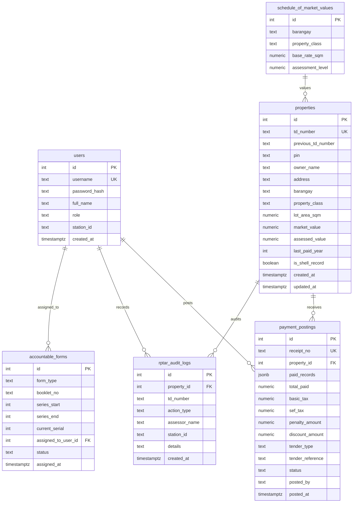

# LGU Treasury Connect — Single Source of Truth (SSOT)
**System Specification & Canonical Architecture Document**  
**Municipality of Santa Rosa, Nueva Ecija — Real Property Tax Administration System (RPTAS)**

---

## 1. Document Control & System Identity

| Property | Canonical Specification |
|---|---|
| **System Name** | LGU Treasury Connect (Santa Rosa RPTAS) |
| **Document Purpose** | Single Source of Truth (SSOT) governing all data models, statutory tax logic, security policies, accountable forms controls, and feature branch implementations. |
| **Jurisdiction** | Municipality of Santa Rosa, Province of Nueva Ecija, Region III, Philippines |
| **Statutory Framework** | Republic Act No. 7160 (Local Government Code of 1991, Title II), Provincial Tax Ordinance of Nueva Ecija, Municipal Revenue Code of Santa Rosa, Commission on Audit (COA) Circulars 2002-003 & 2012-001 |
| **Current Baseline** | v1.0.0 (Vite + React 18 + TypeScript + Local Tailwind CSS + shadcn/ui + Vitest) |
| **Roadmap Companion** | [`ROADMAP_AND_PHASES.md`](file:///home/jeipyyy/Documents/Projects/LGU-Treasury-Connect/lgu-treasury-connect/docs/ROADMAP_AND_PHASES.md) |

---

## 2. Statutory Business & Tax Calculation Rules

All tax calculations in the system must strictly adhere to RA 7160 Title II. These rules are verified by unit tests in [`utils/taxLogic.test.ts`](file:///home/jeipyyy/Documents/Projects/LGU-Treasury-Connect/lgu-treasury-connect/utils/taxLogic.test.ts).

### 2.1 Tax Rates & Allocation
- **Current Operational Year**: `2026` (`CURRENT_YEAR = 2026`).
- **Base Real Property Tax (RPT) Rate**: `2.00%` (`0.02`) of Assessed Value:
  - **Basic Tax**: `1.00%` (`0.01`) allocated to the General Fund of the Municipality and Barangays (RA 7160 Sec. 233).
  - **Special Education Fund (SEF)**: `1.00%` (`0.01`) allocated exclusively to the Local School Board (RA 7160 Sec. 235).

$$\text{Base Tax} = \text{Assessed Value} \times 0.02 = \text{Basic Tax (1\%)} + \text{SEF Tax (1\%) }$$

### 2.2 Property Valuation Formulas
- **Market Value (MV)**: Determined from the Schedule of Market Values (SFMV) based on lot area, classification, and barangay base rates.
  $$\text{Market Value} = \text{Lot Area (sqm)} \times \text{Base Rate per sqm}$$
- **Assessed Value (AV)**: Taxable base derived by applying statutory Assessment Levels (AL):
  $$\text{Assessed Value} = \text{Market Value} \times \text{Assessment Level}$$
- **Canonical Property Classes & Statutory Assessment Levels**:
  - `Residential`: `20%` (0.20)
  - `Agricultural`: `40%` (0.40)
  - `Industrial`: `50%` (0.50)
  - `Machinery`: `80%` (0.80)
  - `Dwell House`: Scaled based on value tiers (default `20%`)

### 2.3 Delinquency Penalties (Surcharges)
- **Accrual Rate**: `2%` per month of delay (`PENALTY_RATE_PER_MONTH = 0.02`) (RA 7160 Sec. 255).
- **Statutory Penalty Cap**: Maximum of `36 months` (`MAX_PENALTY_MONTHS = 36`), capping total penalty at **`72%`** (`0.72`) of the delinquent base tax.
- **Accrual Start**: Past delinquent years accrue from January 1 of that tax year. Current year liabilities accrue penalty quarterly or after statutory deadlines.

$$\text{Effective Delay Months} = \min(\text{Months Delayed}, 36)$$
$$\text{Penalty Rate} = \text{Effective Delay Months} \times 0.02$$
$$\text{Penalty Amount} = \text{Base Tax} \times \text{Penalty Rate}$$
$$\text{Total Year Liability} = \text{Base Tax} + \text{Penalty Amount} - \text{Discounts}$$

### 2.4 Discounts (Prompt & Advance Payment)
- **Prompt Payment Discount**: `10%` discount on current year dues if paid on or before the end of the applicable quarter.
- **Advance Payment Discount**: `20%` discount if the full annual tax for the succeeding year is paid prior to January 1 of that tax year.
- **Strict Rule**: Discounts apply **only** to the Current/Advance year tax, never to delinquent prior-year liabilities.

### 2.5 "Arrears First" Sequential Settlement Rule
- Taxpayers **cannot** pay current year (2026) dues while delinquent prior-year liabilities remain unsettled.
- Payment scopes must be applied strictly in chronological order starting from the earliest unpaid year ($\text{lastPaidYear} + 1$).
- Tellers may select 1 Quarter, 1 Year, or Full Payoff, but selection must anchor on the oldest unpaid record.

### 2.6 Shell Records Rule
- Properties flagged as `is_shell_record = true` represent historical, unverified, or fragmented legacy parcels lacking a verified Tax Declaration (TD) Number or Property Identification Number (PIN).
- **Payment Prohibition**: Shell records **cannot** have payments posted until formally verified, updated with SFMV rates, and certified by the Municipal Assessor.

---

## 3. Canonical Data Architecture & Schemas

The database schema must adhere to this unified specification across Supabase Cloud and On-Premise PostgreSQL.



### 3.1 Strict Field Mapping & Conventions

| Entity | PostgreSQL Column (`snake_case`) | TypeScript Property (`camelCase`) | Type | Nullable | Notes |
|---|---|---|---|---|---|
| **Property** | `id` | `id` | `string` / `number` | No | Primary Key |
| | `td_number` | `tdNumber` | `string` | No | Unique Tax Declaration No. |
| | `previous_td_number` | `previousTdNumber` | `string` | Yes | Prior cancelled TD |
| | `pin` | `pin` | `string` | Yes | Property Identification No. |
| | `owner_name` | `ownerName` | `string` | No | Declared Owner |
| | `address` | `address` | `string` | No | Property location |
| | `barangay` | `barangay` | `string` | No | One of 33 Santa Rosa barangays |
| | `property_class` | `propertyClass` | `string` | No | Residential, Agricultural, etc. |
| | `lot_area_sqm` | `lotAreaSqm` | `number` | Yes | Area in square meters |
| | `market_value` | `marketValue` | `number` | No | Total Market Value (PHP) |
| | `assessed_value` | `assessedValue` | `number` | No | Total Taxable Assessed Value |
| | `last_paid_year` | `lastPaidYear` | `number` | No | Default `2025` |
| | `is_shell_record` | `isShellRecord` | `boolean` | No | Default `false` |
| **Receipt** | `receipt_no` | `receiptNo` | `string` | No | AF-51 Sequential No. |
| | `property_id` | `propertyId` | `number` | No | Foreign Key $\rightarrow$ `properties.id` |
| | `paid_records` | `itemizedRecords` | `TaxYearRecord[]` | No | JSONB array of settled years |
| | `total_paid` | `totalPaid` | `number` | No | Grand total in PHP |
| | `tender_type` | `tenderType` | `'CASH' \| 'CHECK' \| 'ONLINE'` | No | Tender classification |
| | `tender_reference`| `tenderReference` | `string` | Yes | Check No. / Transaction ID |
| | `status` | `status` | `'ISSUED' \| 'VOIDED'` | No | Default `'ISSUED'` |
| | `posted_by` | `postedBy` | `string` | No | Teller name / username |
| | `posted_at` | `date` | `string` (ISO 8601) | No | Timestamp of issuance |

---

## 4. Financial Controls & Accountable Forms (AF-51)

Philippine Local Government Code and Commission on Audit (COA) Circulars mandate strict inventory controls over accountable forms.

### 4.1 Accountable Form 51 (AF-51) Official Receipt Rules
1. **Serial Continuity**: Receipt numbers **must** follow an unbroken sequential series. Random number generation (`Math.random()`) is strictly prohibited in production.
2. **Booklet Stub Custody**:
   - Each physical booklet contains 50 triplicate receipts (Original: Taxpayer, Duplicate: Accounting, Triplicate: Treasury stub).
   - Booklets are assigned to bonded tellers by Booklet Number and Serial Range (e.g. `Series: 4500001 - 4500050`).
3. **Atomic Serial Increment**:
   - The system locks the current booklet record (`SELECT ... FOR UPDATE`) to increment the serial counter during payment generation, preventing race conditions across parallel counters.

### 4.2 Official Receipt Cancellation & Voiding Protocol
1. **Zero Deletion Rule**: Issued receipts are **never** deleted from the database.
2. **Supervisory Dual-Custody**:
   - A teller cannot void their own receipt unilaterally. Voiding requires an `Admin` or `Treasury Supervisor` counter-authorization.
3. **Ledger Rollback**:
   - Voiding an OR resets the associated property's `last_paid_year` to its pre-payment state.
   - The receipt record status changes to `'VOIDED'` with timestamp, cancellation reason code, and authorizing officer username.

---

## 5. Security Architecture & Role-Based Access Control (RBAC)

### 5.1 Role Hierarchy & Permissions Matrix

| Capability / Resource | Admin | Assessor | Cashier (Teller) | Viewer (Mayor / Exec) |
|---|:---:|:---:|:---:|:---:|
| **View Dashboard & Collection KPIs** | ✅ | ✅ | ✅ | ✅ (Read-Only) |
| **Search & View Property Records** | ✅ | ✅ | ✅ | ✅ |
| **Calculate Dues & Tax Assessment** | ✅ | ✅ | ✅ | ✅ |
| **Create / Update Property Masterlist** | ✅ | ✅ | ❌ | ❌ |
| **Verify / Promote Shell Records** | ✅ | ✅ | ❌ | ❌ |
| **Bulk Import Assessment Data (CSV)** | ✅ | ❌ | ❌ | ❌ |
| **Issue AF-51 Official Receipts** | ✅ | ✅ | ✅ | ❌ |
| **Void / Cancel Official Receipts** | ✅ (Authorized) | ❌ | ❌ | ❌ |
| **Manage Users & Stations** | ✅ | ❌ | ❌ | ❌ |
| **Assign Accountable Form Booklets** | ✅ | ❌ | ❌ | ❌ |
| **View Audit Logs** | ✅ | ✅ (Read) | ❌ | ❌ |

### 5.2 Password & Authentication Policy
- **Storage**: Passwords must be hashed using `Bcrypt` (minimum work factor 12) or `Argon2id`. No plaintext passwords may exist in database columns or REST payloads.
- **Sessions**: JWT tokens with 8-hour maximum lifetime; automatic UI inactivity lock after 15 minutes of idle time.
- **Database Enforcement**: Row-Level Security (RLS) enabled on all PostgreSQL tables using verified JWT claims (`auth.uid()` and `auth.jwt() ->> 'role'`).

---

## 6. Architecture & Technology Stack Baseline

### 6.1 Frontend Stack
- **Framework**: React 18 with TypeScript (`strict: true`).
- **Build Tool**: Vite (`vite.config.ts`).
- **Styling**: Tailwind CSS v3 compiled locally via PostCSS (`postcss.config.js`, `tailwind.config.js`). Zero external CDN dependencies.
- **UI Primitives**: Accessible headless primitives (`components/ui/`) styled to Santa Rosa Treasury design tokens:
  - Deep Emerald Green (`#059669` / `#065f46`) reflecting agricultural prosperity and public service trust.
  - Slate gray neutrals (`#0f172a` to `#f8fafc`) for crisp, high-contrast data presentation.
- **Data Visualization**: Recharts (`ResponsiveContainer`, `BarChart`, `AreaChart`).
- **Testing**: Vitest (`taxLogic.test.ts` for RA 7160 statutory verification).
- **Linting**: ESLint v9 Flat Config (`eslint.config.js`).

### 6.2 Data Layer & Repository Contract (`ITreasuryRepository`)
All UI components interact exclusively with the repository contract, decoupling the interface from storage drivers:

```typescript
export interface ITreasuryRepository {
  // Properties & Assessment
  getProperties(params: { search?: string; barangay?: string; page?: number; limit?: number }): Promise<Property[]>;
  getPropertyAssessment(propertyId: string | number): Promise<CalculationResult>;
  saveProperty(data: Partial<Property>): Promise<Property>;
  
  // Collections & Receipts
  processPayment(payload: ProcessPaymentPayload): Promise<OfficialReceipt>;
  voidReceipt(receiptNo: string, reason: string, authorizedBy: string): Promise<void>;
  
  // Accountable Forms
  getActiveBooklet(userId: string | number): Promise<AccountableFormBooklet | null>;
  
  // Reporting & Audit
  getDashboardStats(): Promise<DashboardStatsData>;
  getAuditLogs(filters?: AuditLogFilters): Promise<RptarAuditLog[]>;
  
  // Auth
  login(credentials: LoginCredentials): Promise<AuthSession>;
  lookupUser(username: string): Promise<User | null>;
}
```

Drivers implement this interface:
1. `SupabaseRepository`: Cloud PostgreSQL via `@supabase/supabase-js`.
2. `LocalHttpRepository`: On-Premise local server via REST API (`FastAPI` / `Node.js` / `Go`).

---

## 7. Santa Rosa Geographical & Administrative Constants

### 7.1 Santa Rosa Barangays (33 Canonical Barangays)
The 33 official barangays of Santa Rosa, Nueva Ecija defined in [`constants.ts`](file:///home/jeipyyy/Documents/Projects/LGU-Treasury-Connect/lgu-treasury-connect/constants.ts):
1. `Aguinaldo`
2. `Berang`
3. `Burgos`
4. `Cojuangco (Poblacion)`
5. `Del Pilar`
6. `Gomez`
7. `Inspector`
8. `Isla`
9. `La Fuente`
10. `Liwayway`
11. `Lourdes`
12. `Luna`
13. `Mabini`
14. `Malacañang`
15. `Maliolio`
16. `Mapalad`
17. `Rajal Centro`
18. `Rajal Norte`
19. `Rajal Sur`
20. `Rizal (Poblacion)`
21. `San Gregorio`
22. `San Isidro`
23. `San Joseph`
24. `San Mariano`
25. `San Pedro`
26. `Santa Teresita`
27. `Santo Rosario`
28. `Sapsap`
29. `Soledad`
30. `Tagpos`
31. `Tramo`
32. `Valenzuela (Poblacion)`
33. `Zamora (Poblacion)`

---

## 8. Alignment with Roadmap Phases

Every feature branch defined in [`ROADMAP_AND_PHASES.md`](file:///home/jeipyyy/Documents/Projects/LGU-Treasury-Connect/lgu-treasury-connect/docs/ROADMAP_AND_PHASES.md) implements a specific section of this SSOT:

| Roadmap Phase | SSOT Governing Section |
|---|---|
| **Phase 0: Baseline Finalization** | Section 6 (UI Primitives, Standards, Zero Debt) |
| **Phase 1: Security & Auth Hardening** | Section 5 (RBAC Matrix, Password Hashing, RLS Policies) |
| **Phase 2: Transaction Atomicity & COA** | Section 4 (Atomic RPC, AF-51 Booklet Register, Void Protocol) |
| **Phase 3: Data Layer Optimization** | Section 6.2 (TanStack Query, Realtime WebSockets) |
| **Phase 4: Deployment Abstraction** | Section 6.2 (`ITreasuryRepository`, Cloud vs On-Premise) |
| **Phase 5: Offline Tellering** | Section 4.1 & 6.2 (Offline booklet allocation, Dexie queue) |
| **Phase 6: Statutory Reporting** | Section 2 & 4 (BLGF Form 3, Delinquency Notices, RPTAR Ledgers) |

---

## 9. Governance & Non-Regression Policy
1. **Rule of Immutability**: No tax calculation formula in `utils/taxLogic.ts` may be modified without updating statutory tests in `utils/taxLogic.test.ts` and documenting legal justification under RA 7160.
2. **Schema Migration Pre-requisite**: All schema modifications require versioned SQL migration scripts in `supabase/migrations/` and explicit change budgets per `.agents/rules/task_standards.md`.
3. **No Self-Certification**: Final architectural and security approvals belong strictly to the human reviewer and municipal lead.
